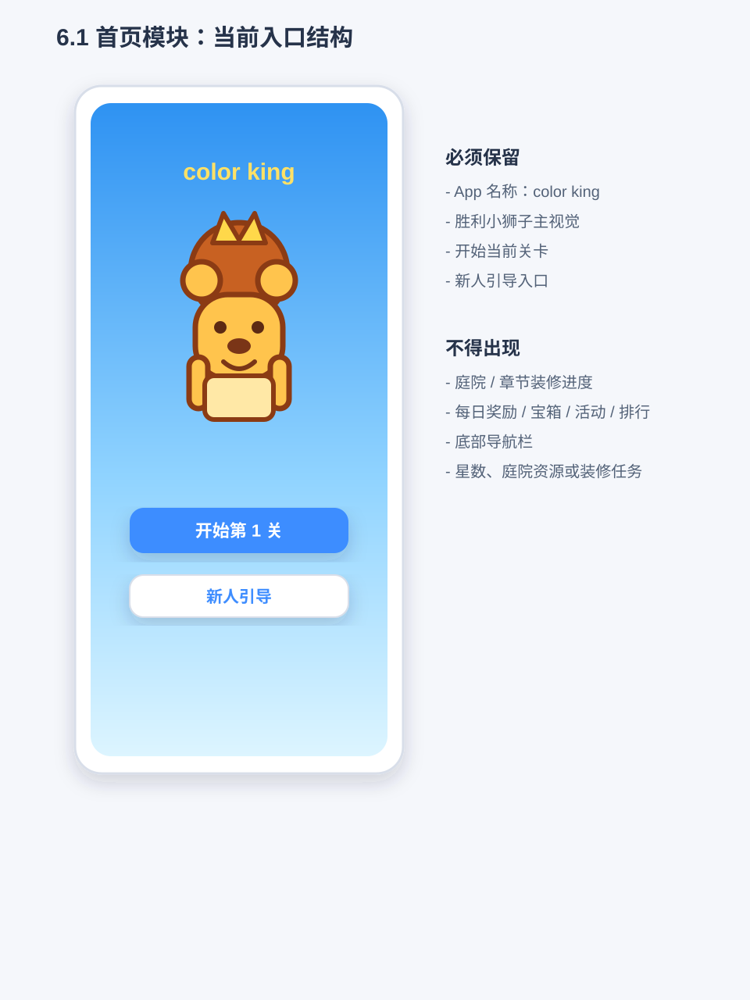
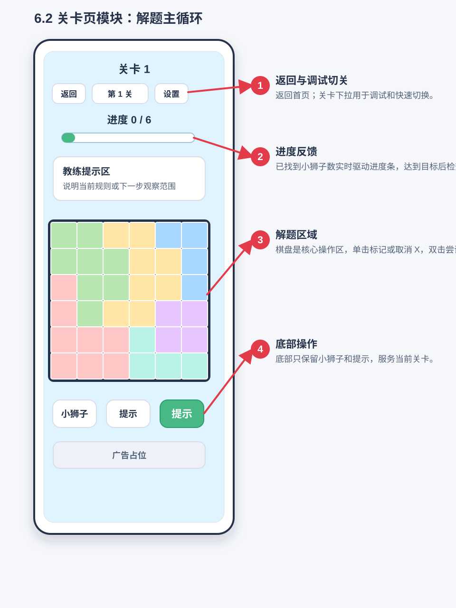
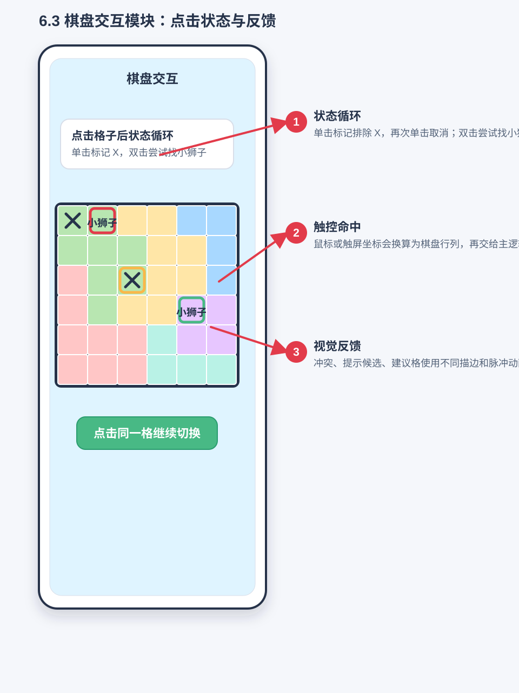
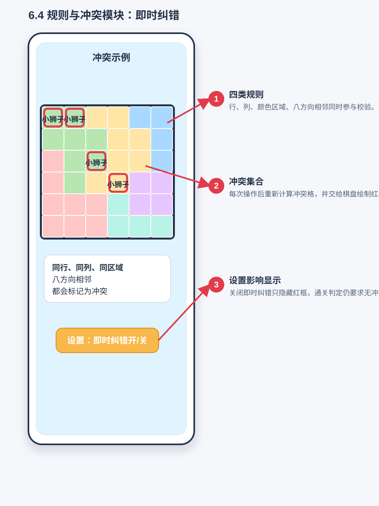
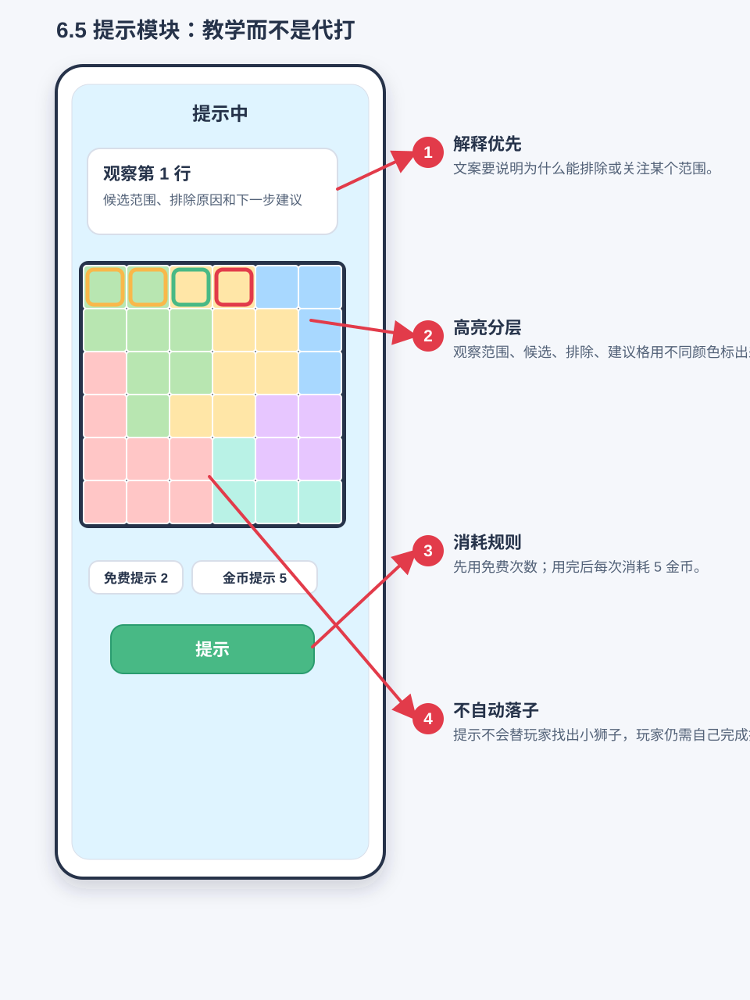
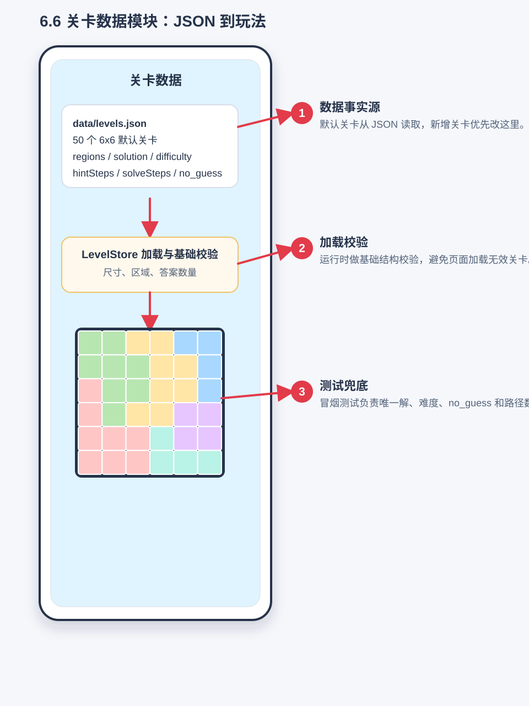
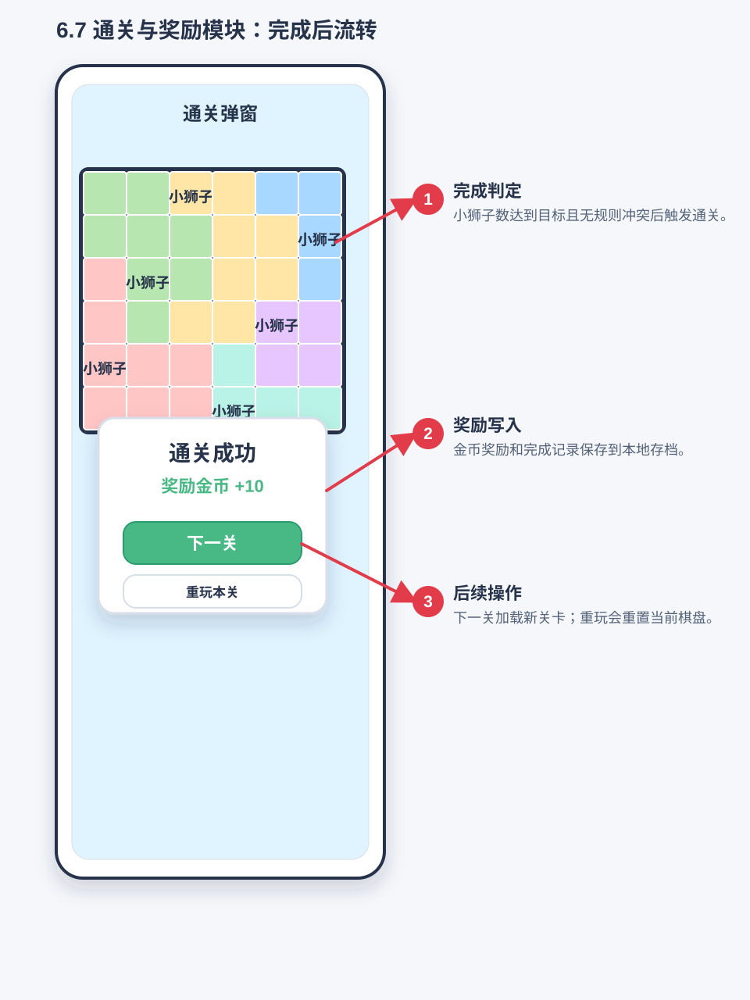
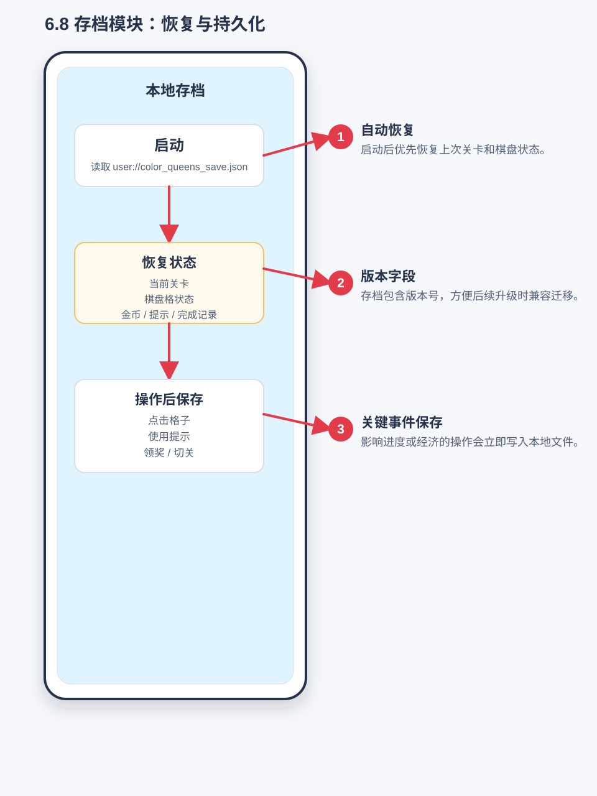

# color king 产品需求文档

最后更新：2026-07-22
适用分支：`jydoit/dev`
当前阶段：Godot MVP

## 1. 文档目的

本文档用于记录 color king 当前产品范围、功能模块、功能逻辑、实现原理和回归测试要求。后续每次功能迭代都必须同步更新本文档，并在正式发布前按本文档执行测试回归。

本文档是项目的产品事实源：

- 新增功能时，先补充或更新对应模块说明。
- 修改玩法、经济、界面、关卡或提示逻辑时，同步更新受影响模块。
- 发布前，以“回归测试清单”为准逐项验证。

## 2. 产品概述

color king 是一款竖屏移动端休闲逻辑谜题。玩家在彩色区域棋盘中找出所有皇冠，需要同时满足四条规则：

- 每一行有且仅有一个皇冠。
- 每一列有且仅有一个皇冠。
- 每个颜色区域有且仅有一个皇冠。
- 皇冠不能八方向相邻。

当前产品参考 Royal Match / Magic Sort 的休闲闯关外壳，但核心玩法保持 Queen / Star Battle 类逻辑谜题，不改为倒水、三消或排序玩法。

部分特殊关卡在找皇冠前增加短时的颜色块拼接阶段：棋盘大部分颜色区域已经锁定，玩家按难度补完 1-3 种被拆散的颜色区域；每种施工颜色保留一个不可移动的同色格作为拼图线索。拼接完成后，棋盘恢复为标准二维颜色区域，再进入相同的找皇冠核心玩法；拼块阶段不改变皇冠阶段的四条核心规则。

## 2.1 项目核心约束

以下约束优先级高于普通 UI 和数值调优；后续实现、测试和验收都必须遵守。

### 2.1.1 核心玩法逻辑

- 核心目标是让用户从棋盘格子中找出所有皇冠。
- 每一行、每一列、每个颜色区域都必须有且仅有一个皇冠。
- 皇冠之间不能挨着，任意两个皇冠不能出现在八方向相邻格。
- 用户可以对格子做两类判断：标记皇冠、标记排除。
- 正式关卡的皇冠尝试判定使用预设标准答案坐标；通关仍要求最终棋盘满足上述规则。

### 2.1.2 核心棋盘交互

- 一般情况下，格子初始状态为空。
- 单击空格表示排除该格，格子显示 X。
- 再次单击已排除格表示取消排除，格子恢复为空。
- 按住并滑过多个可标记格时，应批量处理普通排除 X：从空格开始滑动时连续标记普通 X，从普通 X 开始滑动时连续取消普通 X。
- 双击空格表示尝试标记皇冠。
- 皇冠在视觉上统一使用戴皇冠的卡通小狮子头像贴图，棋盘、开局提示动画、进度和结果页不得继续使用 Unicode 皇冠字符。
- 双击空格或普通排除 X 时，若该格是标准答案格则放置皇冠；若不是标准答案格，则扣除 1 个红心并把该格标记为不可修改的红色 X。
- 正式关卡按展示关卡序号分配红心：第 1-10 关 3 个，第 11-30 关 2 个，第 31 关起 1 个；红心为 0 时，本关失败并显示关卡失败页。
- 滑动操作只能处理普通排除 X，不能标记皇冠，不能改变皇冠或提示皇冠；一次滑动开始时决定是标记模式还是取消模式，过程中不来回翻转。
- 普通排除 X 可以取消。

### 2.1.3 棋盘颜色

- 棋盘颜色需要鲜明、容易区分。
- 相邻颜色区域不应使用相近颜色，避免玩家难以辨认边界。
- 棋盘不能只依赖颜色传达区域信息；棋盘底色为白色，不同颜色区域边缘和棋盘最外缘使用黑色边框，同色区域内部不画边框，帮助色弱或对颜色不敏感的用户区分区域轮廓。
- 默认色板固定使用“明亮经典”10 色：`#E53935`, `#1E88E5`, `#43A047`, `#FDD835`, `#8E24AA`, `#00ACC1`, `#FB8C00`, `#3949AB`, `#7CB342`, `#D81B60`。
- 当前正式关卡最多使用 9 个颜色区域，第 10 个粉色作为后续 10 区域关卡预留；当前 5x5-9x9 正式关卡使用前 9 色。
- 复合拼块关卡的拼接阶段仍使用同一套“明亮经典”色板，但允许通过高光、侧面和投影将颜色区域暂时表现为立体方块；进入找皇冠阶段后必须转换回标准二维棋盘和既有区域边界规范。

## 3. 目标用户与体验方向

目标用户是偏休闲的逻辑谜题玩家。产品体验目标：

- 上手轻：通过首页、关卡、提示和即时纠错降低理解成本。
- 逻辑清楚：提示要解释“为什么”，不能只告诉玩家答案。
- 节奏短：单关 6x6，适合碎片化游玩。
- 可持续迭代：关卡、提示、经济和主界面可以逐步扩展。

## 4. 当前版本范围

已实现：

- 休闲闯关首页。
- 5x5 到 9x9 color king 棋盘玩法。
- 3270 个默认关卡，覆盖 5x5 到 9x9。
- 难度标记：新手、普通、困难、专家。
- 无猜解题路径数据：`logicStatus`、`hintSteps`、`solveSteps`。
- 教学提示：单候选、候选锁定、成组锁定、反证排除、直接冲突排除。
- 金币、提示次数、通关奖励。
- 本地存档。
- Godot 冒烟测试和新手教程冒烟测试。
- 6x6 及以上里程碑挑战关的复合拼块流程：按难度选择 1-3 个颜色区域、立体方块托盘、放置撤回、首次演示、Help、二维转换、动态唯一皇冠答案与存档恢复。

已接入但后续可继续打磨：

- 失败机制已接入正式关卡：前 10 关 3 个红心、第 11-30 关 2 个、第 31 关起 1 个；非标准答案皇冠尝试扣红心并标记红色 X，红心归零显示失败页。

未完成或占位：

- 排行榜、活动、队伍、商店、宝箱为占位入口。
- 当前不显示广告位。

## 5. 信息架构

主要页面：

- 首页：主视觉、开始关卡、新人流程入口。
- 新手引导教程：首次进入第一关前，用单张 5x5 教程棋盘图串联双击找皇冠、滑动排除、同行同列排除、提示线索和通关目标。
- 关卡页：普通关卡直接进入找皇冠；复合拼块关卡先进入颜色块拼接阶段，完成转换后进入找皇冠阶段。
- 通关结果页：通关反馈、皇冠奖励展位、下一关、主菜单。

核心数据：

- `data/levels.json`：关卡配置、答案、难度、提示路径和无猜解题路径。
- `user://color_queens_save.json`：本地存档。
- 新手引导完成状态应写入本地存档，用于决定后续是否直接进入正式关卡。

## 6. 模块需求

### 6.1 首页模块

用户目标：明确当前在 color king 主界面，看到主视觉和最核心入口，一键进入当前关卡、独立体验拼块玩法，并可在不丢失正式进度的前提下重新体验新人流程。

功能逻辑：

- 首屏显示与关卡结果页一致的蓝色主色系背景和 color king 主视觉。
- 首页不显示顶部金币、生命、星数、设置按钮。
- 首页不显示左侧每日奖励、宝箱入口。
- 首页不显示右侧活动、排行榜入口。
- 首页不显示底部星、杯、主页、队、设导航。
- 中下部按“开始关卡 / 拼块玩法 / 新人流程”显示三个按钮；“开始关卡”保持最高视觉层级。
- 首页不显示庭院、章节进度或装修进度。
- “新人流程”按钮用于重新体验新手引导；已有正式进度时先保存正式现场，教程完成或跳过后恢复，新用户没有历史现场时进入第 1 关。
- “拼块玩法”按钮在完成新人流程后可点击，并与普通关卡的 6x6 size 解锁条件保持一致：当前需玩到第 20 关。未达到条件时入口显示“第 20 关解锁”，点击弹窗提示所需关卡且不创建拼块现场；达到后进入独立的 6x6-9x9 复合拼块挑战。进入前保存主线关卡、资源与未完成棋盘，返回首页时完整恢复主线关卡现场；独立体验不增加主线关卡号、通关记录或主线导演统计，但拼块入场费和通关金币会同步保留到共享金币余额。每局先调用普通玩法推荐核心，从已解锁且存在离线拼块数据的棋盘中得到 `size × difficulty class`，再由独立拼块导演为该 size 采样 Simple/Medium/Hard 拆分 pattern。标题显示“拼块挑战 · 第 N 局”，右侧显示实际抽中的 pattern。独立玩法另外保存最近局数、推荐模型、pattern 后验、每日免费次数、入场费、应发奖励、seed、拼块位置、放置顺序、死局状态、红心、道具余量和皇冠阶段棋盘；退出仍恢复主线现场，再次进入时恢复未完成局且不重复计次或收费，最近一局已完成则进入下一局。

当前实现：

- UI 由 `scripts/main.gd` 中 `_build_home_screen()` 及其子函数动态构建。
- 首页主操作由 `_build_home_primary_buttons()` 构建。
- “开始关卡”调用当前关卡流程；“拼块玩法”调用 `_start_home_composite_flow()`，并通过 `CompositeLevelDirector` 进入隔离的自适应拼块挑战；“新人流程”调用 `_replay_tutorial_preserving_progress()` 保存正式关卡快照并进入教程。
- 资源、活动、排行榜、宝箱和底部导航入口已从首页隐藏。

功能截图与交互流转：



回归测试重点：

- 点击开始关卡进入关卡页。
- 点击新人流程会重新进入新手引导。
- 第 19 关及以前点击拼块玩法会弹出“玩到第 20 关即可解锁”的提示，不保存或替换当前主线现场；第 20 关起点击会进入 6x6 拼接阶段，从关卡顶部或结果页返回首页后，主线关卡、棋盘现场和资源恢复到进入前状态。
- 首页不显示金币、生命、星数、左侧入口、右侧入口和底部导航。

### 6.2 关卡页模块

用户目标：完成当前关卡，清楚知道关卡进度、剩余操作和规则反馈。

功能逻辑：

- 顶部栏包含加大的返回首页按钮、金币图标与余额、独立红心体力槽、帮助、设置和“选关”按钮；底部操作区同一行显示清除、皇冠直找和提示三个道具；不显示排行榜或其它资源入口。
- 关卡标题只显示关卡编号，不显示关卡名称。
- 帮助按钮打开规则浮窗。普通关卡默认展示“消除规则”，使用三张棋盘示意图说明皇冠邻格、行列和颜色区域规则；复合拼块关卡额外提供“拼块玩法”页，说明拿取、放置、横向滑动托盘、撤回方块和完成后的棋盘转换。
- “选关”按钮打开关卡选择弹窗，用户确认后直接切换到所选正式关卡；完整选关列表仅在实际打开该调试弹窗时构建，不在启动、首页刷新或语言切换时重复生成。
- 正式关卡不显示“国王提示”或其它教练文字卡；新手教程仍显示必要的教学文案。
- 正式关卡点击提示后只改变棋盘视觉和可操作范围，不显示提示解释文字或成功提示 Toast。
- 棋盘占据主要空间，正式关卡底部保留清除、皇冠直找和提示按钮。
- 复合拼块关卡处于拼接阶段时，隐藏皇冠进度和清除、皇冠直找、提示三个道具，不允许使用或购买道具；底部原道具区域替换为深色横向滑动方块托盘。拼接完成并经过转换动画后，托盘退出，皇冠进度与三个道具恢复。
- 底部不显示广告占位。

当前实现：

- UI 由 `scripts/main.gd` 中 `_build_game_screen()` 及其子函数构建。
- 冲突状态由 `_validate_and_update()` 更新。
- 教练文字卡仅在新手教程中显示；进入正式关卡后隐藏并退出纵向布局，释放空间主要交给棋盘。
- 关卡页左右安全留白为 `6px`，棋盘内部总缩进为 `10px`；在 540px 宽竖屏下，5x5 棋盘实际绘制范围不小于 `510 x 510px`。
- 顶部编辑和底部广告入口已从关卡页移除；顶部资源栏显示加大的首页入口、金币、本关红心、帮助、设置与选关入口，底部操作区显示清除、皇冠直找和提示按钮。
- 帮助内容由 `scripts/main.gd` 构建，三张规则示意图由 `scripts/rule_illustration.gd` 使用现有狮子皇冠贴图与棋盘色板绘制。
- 帮助、选关、教程确认和金币不足提示统一由 `scripts/dialog_controller.gd` 管理，使用游戏内遮罩、暖白卡片、统一边框、圆角、阴影、按钮和开关动效，不依赖系统窗口外观。
- 新手教程复用正式关卡的顶部标题、皇冠进度、帮助入口、红心槽和底部三道具布局；教程期间仅将“选关”替换为“跳过”，避免绕过引导进入正式关卡。

功能截图与交互流转：



回归测试重点：

- 页面在移动端宽度下按钮和棋盘不溢出。
- 正式关卡不显示黄色教练文字区；隐藏后棋盘布局高度相应增大，顶部栏仅小幅增高。
- 关卡页顶部显示加大的首页按钮、金币余额、本关红心、帮助、设置与选关入口，底部显示清除、皇冠直找和提示按钮，不显示排行榜、编辑和广告。
- 点击帮助按钮会打开消除规则浮窗，三张示意图和文字分别准确表达邻格、行列和颜色区域规则。
- 复合拼块关卡的拼接阶段打开帮助时默认进入“拼块玩法”页；进入找皇冠阶段后默认回到“消除规则”，但仍可切换并重播拼块流程动画。
- 所有模态弹窗同一时间只显示一个，并统一拦截底层棋盘输入、支持取消键关闭和移动端安全边距。
- 点击“选关”可打开选择弹窗，并能进入所选关卡。
- 关卡标题只显示关卡编号。
- 新手教程显示与正式关卡一致的标题、帮助、红心、皇冠进度和三道具布局，并以“跳过”替代“选关”。

### 6.3 棋盘交互模块

用户目标：通过点击格子标记排除，通过双击格子尝试找出皇冠，直观看到颜色区域、皇冠、普通 X、红色 X、冲突和提示可操作范围。

功能逻辑：

- 单击空格标记普通排除 X。
- 再次单击普通排除 X 取消标记，恢复为空格。
- 单击普通皇冠会转为普通排除 X；提示皇冠保持锁定，不可点击修改。
- 按住并从空格开始滑动时，沿途空格连续标记为普通排除 X。
- 按住并从普通 X 开始滑动时，沿途普通 X 连续取消为空格；滑动经过皇冠或提示皇冠时保持原状态。
- 双击空格或普通排除 X 尝试标记皇冠。
- 双击标准答案格放置张嘴开心笑、眼睛带高光的狮子皇冠；双击非标准答案格会显示嘴角向下的苦笑狮子，并叠加不可修改的红色 X 徽标，同时只扣除 1 个红心，不扣除皇冠直找次数、提示次数或金币。
- 正式关卡进入或重试时按展示关卡序号重置红心：第 1-10 关 3 个、第 11-30 关 2 个、第 31 关起 1 个；错误皇冠尝试扣 1 个红心，红心为 0 时锁定棋盘并弹出关卡失败页。
- 皇冠直找按钮与清除、提示按钮同一行显示；每个用户初始 3 次，点击后直接把一个未找到的标准答案格标记为锁定皇冠。三个按钮统一使用紧凑的“图标 + 简短名称 + 固定高度状态胶囊”结构：清除显示“免费”，直找和提示有次数时显示“免费 ×N”；次数为 0 时不显示 `×0`，状态胶囊直接切换为金币图标和本次价格。工具栏不得挤压棋盘或在 540×960 竖屏下越过底部安全区。
- 清除为永久免费道具，清除普通排除 X、普通皇冠和错误红色 X；保留开局提示皇冠和皇冠直找产生的提示皇冠，清除错误标记不返还已扣除的红心，清除结果可以撤销。
- 关卡失败页沿用通关结果页蓝色整屏风格，文案为失败反馈，按钮为显示动态价格的“金币复活”和“重新挑战”。
- 棋盘支持鼠标点击和触屏点击。
- 有冲突时冲突格变红。
- 提示和新手引导时，全部提示相关格和已有 X/皇冠/错误 X 保持正常亮度，不加高亮框、不闪烁；其它空格覆盖透明灰色浮层，并禁止点击。
- 操作后提供轻量动画反馈；正确和错误放置必须使用同一狮子角色的不同表情，保证状态反馈清晰且角色一致。

当前实现：

- 交互状态由 `scripts/main.gd` 中 `cell_states` 管理，状态包括 `empty`、`blocked`、`piece`、`hint`、`king`、`wrong`。
- 棋盘绘制由 `scripts/game_board.gd` 自绘完成。
- 棋盘渲染使用整数像素对齐的格子尺寸和起点；每个格子保持独立圆角矩形，颜色块和提示灰色浮层使用同一套独立格子坐标，避免小数像素造成的视觉错位。
- 棋盘格子之间的缝隙使用底层填充：每个格子的圆角留白也归入间隔层，同色相邻格之间使用该色的加深色；不同色块边界和棋盘最外缘统一使用预合成后的深色外框色，外框宽度与相邻格子的总间隙一致并随棋盘尺寸变化；深色外框外侧增加只向外扩散的双层浅暖灰光晕，不覆盖棋盘色块。
- 共享颜色、棋盘间隔、圆角、线宽和标记参数统一由 `scripts/ui_tokens.gd` 提供，页面和棋盘引用同一套运行时设计 token。
- 普通 X 使用带浅色细描边的深色线条，错误红 X 使用浅色粗描边、深红主线和柔和红色底晕，确保在全部默认区域色上均可辨认。
- 关卡标题下方显示皇冠进度条和 `已找到 / 本关总数`；有开局提示皇冠时先显示数量浮层，再将皇冠逐个动画移动到对应格子并更新进度。
- 开局提示皇冠的回弹动画只调整字号，最大不超过格子尺寸的 `72%`，边缘格动画不得越过棋盘外框。
- `GameBoard` 通过 `cell_pressed(row, col)`、`cell_double_pressed(row, col)`、`cell_drag_started(row, col)`、`cell_dragged(row, col)`、`cell_drag_ended()` 信号把点击、双击和滑动传回主逻辑。
- 高亮类型包括 `unit`、`candidate`、`exclude`、`place`。
- `play_cell_feedback()` 和 `play_guide_feedback()` 提供格子反馈动画。

功能截图与交互流转：



回归测试重点：

- 第一次点击为空格标记 X。
- 第二次点击同格取消普通 X。
- 按住从空格开始滑动可连续标记普通 X；按住从普通 X 开始滑动可连续取消普通 X；滑动不会影响皇冠或错误红色 X。
- 双击正确答案格显示皇冠并触发反馈。
- 双击非答案格显示红色 X、只扣除 1 个红心并触发反馈；不得扣除皇冠直找次数、提示次数或金币。红色 X 不可通过单击或滑动修改，但清除道具可以移除，且不会返还已扣除的红心。
- 点击皇冠直找按钮会直接找到一个锁定皇冠并消耗 1 次；次数为 0 时不可继续使用。
- 点击清除会移除普通 X、普通皇冠和错误红色 X，不核销金币、不恢复红心或免费道具次数，并保留开局提示皇冠和皇冠直找产生的提示皇冠。
- 普通 X、红色 X、皇冠、高亮和冲突图形可见且不遮挡棋盘。
- 棋盘在不同窗口尺寸下保持正方形比例。

### 6.4 规则与冲突模块

用户目标：放错时能及时知道哪里违反规则。

功能逻辑：

- 任意两个皇冠如果同行、同列、同颜色区域或八方向相邻，则视为冲突。
- 开启即时纠错时，冲突格高亮。
- 即时纠错当前为内部开关，不提供前端设置入口。

当前实现：

- `_find_conflicts()` 遍历当前皇冠位置并检查四类冲突。
- `_validate_and_update()` 负责刷新错误状态和进度；正式关卡不展示教练提示文字。
- `immediate_errors` 控制是否显示即时错误。

功能截图与交互流转：



回归测试重点：

- 同行、同列、同区域、相邻两个皇冠均显示冲突。
- 关闭即时纠错后不显示红色冲突，但通关仍要求无冲突。

### 6.5 提示模块

用户目标：通过棋盘上的视觉差异找到当前可以确定排除的非皇冠空格，并单击画普通 X。

功能逻辑：

- 正式关卡提示范围只能包含可排除的非皇冠空格，不提示皇冠位置，也不把候选观察格或推理单元放入可操作范围。
- 提示消耗免费次数；免费次数用完后消耗金币。
- 免费提示初始为 5 次。
- 免费次数用完后，按钮主标签保持“提示”，底部固定状态胶囊由“免费 ×N”切换为小金币图标和当前动态价格，不显示 `×0`。
- 提示通过整盘 `70%` 冷灰蒙层、正常亮度的提示相关格和可操作范围表达，不显示文字解释；区域边界随蒙层统一变暗但不隐藏。
- 正式关卡提示范围内的全部格子统一使用 `exclude_empty`，保持正常亮度、允许单击画 X，并播放一次柔和光环；已有 X/皇冠仍保持正常亮度，但不进入提示操作范围。
- 当前棋盘没有可确定排除的非皇冠空格时，提示不生效，也不扣除免费次数或金币。
- 提示应优先给出可以推进棋盘的逻辑判断。

当前提示策略顺序：

1. 候选锁定：某单元候选全部落在另一单元内，返回另一单元中可以画 X 的格子。
2. 成组锁定：多个单元共同锁定一组行、列或颜色区域，返回组外可以画 X 的格子。
3. 反证排除：如果某格是皇冠会导致某个单元无解，返回该格作为 X 目标。
4. 直接冲突排除：已有皇冠导致某格必然冲突，返回该格作为 X 目标。

当前实现：

- `_use_hint()` 执行提示消耗并设置棋盘视觉与可操作范围，不更新任何玩家可见提示文案。
- `GameBoard` 先对整个棋盘（含格间接缝和区域边界）绘制统一蒙层，再在蒙层上重绘提示相关格、已有 X 和皇冠，从绘制结构上避免逐格蒙层造成的接缝错位。
- `_build_best_next_hint()` 负责选择当前最佳提示。
- 相关策略函数集中在 `scripts/main.gd` 的提示逻辑区。
- 提示策略仍可在内部生成推理信息，但正式关卡不向玩家展示这段文字。
- 关卡数据中的 `solveSteps` 记录无猜路径，但当前运行时提示主要按当前棋盘动态计算。

功能截图与交互流转：



回归测试重点：

- 点击提示不会自动找出皇冠。
- 正式关卡提示范围中的每一格都是空白非皇冠格，并且都能单击变成普通 X。
- 提示会消耗 1 次免费提示或按当前关卡动态核销金币。
- 金币不足时展示购买金币 / 观看激励广告选择弹窗，不自动播放广告。
- 提示后不出现解释卡或成功 Toast，只通过棋盘图像差异表达提示范围。
- 提示生效时可操作范围至少包含一个非皇冠 X 目标；候选观察格、推理单元和其它空格不进入提示范围。
- 对 50 关至少能从数据层证明唯一解和 no-guess 路径存在。

### 6.6 关卡数据模块

用户目标：获得稳定、可解、难度递进的关卡内容。

功能逻辑：

- 默认包含 3270 个关卡，覆盖 5x5 到 9x9。
- 每关包含唯一答案。
- 每关必须标记难度。
- 每关必须标记 `logicStatus: no_guess`。
- 每关必须包含 `hintSteps` 和 `solveSteps`。

当前实现：

- 数据文件：`data/levels.json`。
- 加载器：`scripts/level_store.gd`。
- 出关导演：`scripts/level_director.gd`，负责解耦玩家显示关卡顺序与 `levelId`。
- 前 10 个显示关卡固定编排：1-5 为 5x5 simple，6-8 为 5x5 medium，9 为 5x5 simple，10 为 5x5 hard 挑战关。
- 第 10 关之后根据玩家进度、size、难度和最近行为动态选择关卡；关卡选择按 size/difficulty 索引读取，并用最近 50 个 `levelId` 做去重。
- 动态 size 解锁节奏由 `SIZE_UNLOCK_DISPLAY_LEVELS` 统一控制：第 1 关开放 5x5，第 20 关起开放 5x5-6x6，第 80 关起开放 5x5-7x7，第 160 关起采样 6x6-8x8，第 240 关起采样 6x6-9x9。
- 每逢 10 的整数关为挑战关；挑战关后一关为缓冲关，保持挑战关 size、难度降低一档，并显示提示皇冠。
- 普通关卡使用分层后验推荐：size 层使用 Dirichlet 多项分布，size 内的 difficulty 层使用 Dirichlet 多项分布，每个 size×difficulty 组合分别维护通关、下一关开启和次日留存三个 Beta-Bernoulli 后验，并用 Thompson Sampling 选择。
- 新 size 解锁时降低旧 size 的历史探索权重，为新 size 写入冷启动加成并优先探测 Medium；每个 size 和组合都有最低曝光配额，未充分曝光的组合优先于稳定收益采样。
- 选择时观察最近 5 局：若存在高于最近主尺寸且尚未探测的 size，优先该 size 的 Medium；否则优先最近 5 局最大 size 中尚未探测的组合。连续 3 局未使用道具时提高难度压力，最近最大 size 的探测优先 Hard。
- 普通关卡固定记录直找和提示的使用概率。没有未探测组合后，组合配额和 Thompson Sampling 使用最高道具收益权重，促进玩家在更高难度下使用帮助工具。
- 每逢 10 关的挑战分支以及挑战后的下一关缓冲分支保持独立于普通后验推荐，后一关沿用挑战 size 并降低一档难度。
- 第 11-50 关保留提示皇冠；50 关后每隔 5 关屏蔽一次提示皇冠。
- 动态提示皇冠数量按棋盘 size 加权：5x5 固定 1 个，6x6 为 1-2 个，7x7 为 1-3 个，8x8 及以上为 1-3 个。
- 基础校验包括行列尺寸、区域行列数和答案数量。
- 更完整的唯一解与路径校验目前由 `tests/smoke_test.gd` 覆盖。

功能截图与交互流转：



回归测试重点：

- `levels.size() >= 50`。
- 每关为 6x6。
- 每关答案满足行、列、区域唯一和不相邻。
- 每关唯一解。
- 每关存在难度、`logicStatus`、`hintSteps`、`solveSteps`。

#### 6.6.1 复合拼块关卡

用户目标：在进入找皇冠前，通过短时、可撤回的积木拼接补完整个颜色棋盘，再破解由最终颜色边界确定的皇冠谜题。

适用范围：

- 复合拼块玩法只用于 6x6-9x9 的特殊关卡，不进入 5x5 关卡和现有单张 5x5 新手教程。
- 当前出关规则为：展示关卡序号为 10 的整数倍、并且本关实际尺寸不小于 6x6 的里程碑挑战关启用复合拼块；其它关卡保持直接找皇冠。
- 棋盘不会从完全空白开始。开局锁定大部分完整颜色区域，并按拼块难度从 1-3 个颜色区域中移走大部分格子；每种施工颜色保留 1 个不可移动的原色格作为形状与颜色锚点。
- Simple 使用 1 或 2 个施工颜色；Medium 使用 2 个；Hard（含 Challenge 映射）使用 3 个。多颜色方块可在全部施工格内形成多个经过验证的连续边界，完成后根据最终布局匹配并锁定对应的唯一皇冠答案。
- 复合关卡属于普通找皇冠流程的前置阶段，不独立结算奖励，不额外消耗红心、金币或道具次数。

关卡阶段：

1. `assembly_intro`：首次体验时播放拼块流程动画；已经看过时直接进入拼接。
2. `assembly`：显示锁定的立体颜色区域、空白施工区和棋盘上方的横向待放置区。
3. `assembly_transition`：拼接完成后锁定输入，播放立体方块合板并转换为二维颜色棋盘的过场动画。
4. `crown`：加载最终 `regions` 与唯一 `solution`，恢复皇冠进度、红心判定和底部三个道具，按现有正式关卡规则解题。

页面布局：

```text
顶部：返回首页 / 金币 / 红心 / Help / 设置 / 选关（独立玩法隐藏选关）
标题：主线显示第 X 关；独立玩法显示“拼块挑战 · 第 N 局” + “先拼好颜色区域”阶段标识
顶部（棋盘上方）：深色横向待放置区，单屏约显示 3-4 个块，未放置块优先，已完成 slot 靠后
中部：正方形 6x6-9x9 棋盘
底部：清除 / 直找 / 提示三个道具，沿用正式关卡工具栏位置
```

- 拼接阶段保留顶部导航与关卡标题，隐藏皇冠进度，避免在答案尚未锁定前传达错误进度。
- 拼接阶段保留底部清除、直找和提示工具；清除清空已放置方块，直找和提示沿用正式关卡的免费次数与金币核销规则。
- 待放置区固定为单行横向排列，按“未放置优先、颜色剩余格数升序、同色块连续、块自身格数升序”自动排序；已放完的 slot 置于列表末端并降低透明度。单屏约显示 3-4 个块，内容超出承载区时左右滑动查看更多。
- 拼接结束后页面骨架不换页：阶段标识淡出、皇冠进度出现、顶部待放置区退出、底部三个道具继续沿用正式关卡布局。

棋盘与方块视觉：

- 拼块棋盘的底板、外沿和施工凹槽统一使用浅暖灰色系，通过逐级明度和内外阴影区分承托面与空槽，避免底板出现割裂的灰色色块。
- 已锁定颜色区域使用原“明亮经典”颜色，并复用中性灰白的单格立体砖贴图 `assets/ui/block_tile_neutral.png`；运行时以区域颜色乘色，统一得到圆角顶面、左上高光、下沿厚度和柔和投影。锁定区域不可点击、拖动或旋转。
- 施工区显示为低饱和浅暖灰凹槽，保留格子坐标和施工区外轮廓；施工颜色遗留的锁定原色格保持与待放置块一致的立体材质，作为颜色和连通方向线索，但不提前显示最终区域边界。
- 托盘背景使用深色系，与暖白关卡背景形成明确层级；每个可见 slot 使用所属颜色的加粗发光外框。同一个拼图块中的所有格子必须共用该块所属区域的一种颜色，并复用与棋盘一致的单格立体砖贴图拼装成完整形状，不能为不同形状或不同颜色分别维护重复图片。
- 用户拿起方块后，方块缩放到棋盘格尺寸并保持立体状态；拖动超过短距离即进入拖动状态并以当前指针位置实时更新预览，减少拿取延迟。只要完整位于施工区且不与其它已放方块重叠，就显示合法占格预览并允许吸附；越界或重叠时显示错误预览并回弹。
- 方块成功放到棋盘后仍保持立体状态；只有所有施工格完成且布局通过校验后，才在过场动画中统一压平为标准二维区域。
- 颜色不能成为唯一状态信息。合法/非法落点同时使用轮廓、占格预览和回弹反馈，锁定区与可拼区通过高度、凹槽和交互反馈区分。

拼接交互：

- 待放置区的横向手势用于滚动；从待放置块向下拖动时拿起方块，避免左右浏览和拿取冲突。
- 拿起后方块跟随手指，显示相对手指上移的触点偏移，防止手指遮挡目标格。
- 方块只允许落在施工区，必须完整对齐格子，不能越界或与其他方块重叠。
- 随机切分阶段允许对形状模板做 `0° / 90° / 180° / 270°` 旋转并把结果固化到关卡；第一版玩家只选择放置位置，不在拖放过程中主动旋转或镜像方块。
- 玩家可以从棋盘重新拿起自己已经放置的方块，并拖回棋盘上方待放置区；进入回收热区后，系统对焦该块当前的完成 slot，用户释放时直接依据释放位置判定，不依赖最后一帧拖动事件，随后立即按自动排序规则重新插入，并保持原始方向。释放事件先完成界面状态更新，存档写盘延迟到下一帧，避免手机端同步 JSON 写盘阻塞吸附反馈。
- 已锁定区域始终不能被拿起；拼接阶段不响应普通 X、滑动 X 或双击皇冠，但底部清除、直找和提示可用。
- 直找选择当前颜色中剩余空白格最少的施工区域，依据当前兼容的正确布局一次完整填入该颜色的所有剩余方块。
- 提示会遍历当前放置仍兼容的全部候选布局，优先从仍有合法空位的未放置块中选择正确位置；同色块较多时按当前可用落点数量、块大小和稳定顺序选择，确保提示落点确实是空白可放置区域。如果空白区域已被阻塞，则从最接近正确布局的已放置错误块中给出应回收和重放的位置；即使当前没有合法空位，也保留正确块、颜色和行列位置的浮窗提示，不直接修改放置状态。
- 每次成功放置、移动和回收方块后立即保存；退出再进入时恢复相同托盘槽位占用、方块位置和阶段。

完成判定：

- 施工区全部覆盖且没有重叠或空洞。
- 每个被挖空的颜色区域合并后必须通过上下左右连通性校验，不能出现同色孤岛。
- 最终区域数量必须等于棋盘尺寸，每个完整区域保持连续。
- 最终布局必须存在唯一皇冠解，并满足行、列、区域唯一和皇冠八方向不相邻。
- 最终布局必须通过对应难度的无猜路径校验，能够为正式 Hint 提供只画 X 的合法目标。
- 放置系统不再用预验证布局白名单限制吸附，所有空间合法位置均可放置。部分拼块状态的死局检测只以已放置方块和固定线索为强制颜色：已放异色块是障碍，全部未占空白格对每一种颜色都视为可通行、可用于未来连接；只有某颜色的已放块与固定线索之间经过空白格仍无法连通，或某个剩余实体块已无任何空间落点时，才进入拼块死局页。全部方块放完后再严格校验完整覆盖、同色连续和皇冠唯一解。
- 拼块死局页提供“金币复活”和“重新开始本局”。金币复活沿用当前复活动态价格，扣费后系统自动把最后一次放置或移动的方块放回托盘，其余现场不变；重新开始会清空本局全部拼块位置并复用当前关卡和 seed。
- 拖动方块的视觉位置与吸附换算必须使用同一个“方块在手指上方”锚点；合法凹槽在约 1 格距离内提供邻近磁吸，确保四格高竖条、L 形及其它异形块视觉对齐时可以稳定落位。
- 拼接完成后 `regions` 和 `solution` 一次性锁定。进入皇冠阶段后不得因重试、切后台或重新启动而重新随机。

随机切分策略：

- 合格施工颜色至少包含 3 格；移除 1 个线索格后，每个施工颜色至少生成 1 个可移动拼块。设可移动格数为 `C`、标准最小拼块格数 `MIN_PIECE_CELLS=2`，块数使用 `ceil((C / MIN_PIECE_CELLS) × factor)`，并限制在 `1...floor(C / MIN_PIECE_CELLS)`：Simple/Medium/Hard 的 `factor` 分别为 `0.5/0.6/0.8`。难度越高，同面积颜色区域会被拆成越多块。
- Simple 以 `0.55` 概率选择 1 个施工颜色，此时选择合格区域中覆盖格数最多者；以 `0.45` 概率选择 2 个相邻施工颜色，此时选择合计覆盖格数最少的合法相邻组合。
- Medium 固定选择 2 个相邻施工颜色；Hard 固定选择 3 个彼此通过相邻关系连成一组的施工颜色。Medium/Hard 都以“覆盖格数 + 合并包围盒跨度 + 区域中心两两距离”作为 spread 得分，选择得分最高组合；Challenge 按 Hard 执行。
- 每个施工颜色保留 1 个线索格，所有难度使用同一选择规则：先从颜色区域边界格中删除割点候选，确保移除线索后该颜色的剩余格仍保持上下左右连通；再分别计算安全候选所在行、所在列中“不同于当前区域颜色”的格子数量，使用 `max(行异色格数, 列异色格数)` 作为候选分数并优先最高分。并列时优先八邻域同色格更多者，仍并列时使用固化 seed 随机选择；没有安全边界候选时放弃本次生成。
- 切分从线索格的相邻位置向外随机填充模板，前序块使用横竖条、2×2 方形、L、T、S/Z 及异构模板；最后一个块直接接管该颜色剩余的全部格子。
- 切分过程不要求每次提取模板后“剩余格图仍连通”，也不以中间态孔洞作为拒绝条件；但交付给玩家的每个独立拼块都必须上下左右连通。最后剩余格若由多个孤岛组成，本次拆分失败并重新随机尝试，不能把多个孤岛合并为同一个异形块。最终完成的颜色区域仍必须连续，并继续经过唯一皇冠解校验。
- 正常生成避免单位块：若最后只剩 1 格则重新随机拆分，最多尝试 3 次；三次后仍无法避开时才允许生成 1 格兜底块。切分器继续使用可持久化随机种子。
- Simple 仍提高矩形和短条权重；Medium 增加 L 与 Z 形；Hard 增加 L、Z 和非对称异构体，但最终布局必须能够完整覆盖施工区且皇冠答案唯一。
- 对生成的方块集合枚举或搜索完整铺法，删除区域断开、无皇冠解、多皇冠解、无法无猜推进或难度越界的结果。
- 单区域模式至少保留 1 个合法完整铺法；双区和三区模式在搜索预算允许时目标保留 2-6 个不同颜色边界的合法铺法，避免既完全无选择也过度开放。
- 预验证布局继续用于生成期质量筛选和已知布局快速匹配；运行时允许预验证集合之外的空间合法摆法，并对玩家最终颜色边界现场求解，绝不为了得到答案偷偷改动已拼出的边界。

首次流程动画与 Help：

- 用户账号第一次进入任意复合拼块关卡时自动播放一次流程动画，后续复合关卡不再强制播放。
- 动画依次展示：锁定区域不可移动、施工区目标、左右滑动待放置区、向下拖出一个方块、合法吸附、把已放方块拖回顶部待放置区、完成后立体棋盘转换为二维皇冠棋盘。
- 演示使用影子手势和演示副本，不改变真实方块位置；动画完成后重置为本关真实初始状态并开放输入。
- `compositeTutorialSeen` 只在动画完整播放结束或用户明确跳过后写入存档；应用在动画中途退出时，下次仍应重新播放。
- Help 增加“拼块玩法”页，长期保留相同流程的分步示意和“重播演示”入口。拼接阶段点击 Help 默认打开此页，皇冠阶段默认打开“消除规则”。
- Help 文案至少覆盖：彩色方块只能放入凹槽、左右滑动待放置区查看更多、方块需完整对齐、已放方块可拖回顶部、同色必须连续、拼完后进入找皇冠。

过场动画：

- 最后一块合法吸附后立即锁定棋盘和托盘输入，避免完成瞬间又被拿走。
- 所有立体方块先进行一次短促落位确认，再同步降低侧面高度和投影，合并同色内部拼块缝隙，只保留最终颜色区域边界。
- 顶部待放置区向上退出，页面背景恢复标准关卡视觉；阶段标识淡出，皇冠进度继续出现，底部三个道具保持在原位置。
- 如果最终关卡配置有开局提示皇冠，只能在 `solution` 锁定且二维棋盘转换完成后播放，不能在拼接过程中出现。
- 过场期间拦截全部输入，目标总时长控制在 `0.8-1.4s`，可读但不拖慢重复游玩。

当前数据结构：

```json
{
  "mode": "assembly_then_crown",
  "assembly": {
	"cutSeed": 20260722,
	"constructionCells": [[0, 0]],
	"clueCells": [[0, 1]],
	"lockedRegionIds": [1, 2, 3, 4],
	"pieces": [],
	"validLayouts": []
  }
}
```

- `pieces` 至少保存 `pieceId`、`regionId`、规范化局部格坐标、固化方向和初始托盘顺序。
- `validLayouts` 至少保存布局签名、最终 `regions`、唯一 `solution`、难度与逻辑校验结果。
- 存档新增复合玩法阶段、随机种子、托盘槽位占用 `traySlots`、各方块放置坐标、放置历史、死局状态、最终布局签名、锁定后的 `regions` 与 `solution`，并保存 `compositeTutorialSeen`。

当前实现：

- `scripts/composite_level.gd` 将关卡难度归一为 Simple/Medium/Hard，按 `1-2/2/3` 个颜色区域策略选择施工区；线索先排除会切断区域的割点，再从安全边界格中按 `max(行异色格数, 列异色格数)` 选择，随后从线索邻域随机铺设条形、2×2、L/T/Z 和异构模板，最后用剩余块补齐。生成期保留质量合格布局，运行时同时支持任意空间合法吸附、动态最终布局校验和死局搜索。
- 离线拼块数据生成器位于 `tools/generate_composite_levels.py`，直接读取 `data/levels.json`，完全在 Python 内执行区域选择、线索筛选、模板拆块、动态 MRV Exact Cover、皇冠唯一解求解和放置顺序生成，不启动 Godot 或调用 GDScript。生成结果写入 `data/composite_levels.json`：当前为 2000 个 6x6-9x9 基础关卡各生成 Simple/Medium/Hard 三档，共 6000 条；5x5 不进入复合拼块。运行时由 `scripts/composite_level_store.gd` 按 `levelId:difficulty` 加载，不再对正式关卡在线拆分；缺少离线条目时关闭本关拼块入口。线索点从非割点安全边界格中按 `max(行异色格数, 列异色格数)` 取最高分，同分时只按固化 seed 选择。离线唯一性只统计同时满足“每块一次、无重叠、填满施工区、方块颜色逐格匹配原始 `regionId`”的完整方案；同颜色、同形状、同方向的视觉相同块只交换内部编号时视为同一方案。每个颜色区域拆分后先独立证明区域铺法唯一，再进入整局搜索；整局搜索使用占格位掩码、剩余等价块组和候选下界组成的记忆化状态，结果截断为 `0/1/2+`。切分期按候选落点数量、重复形状和强制剥离链质量排序，并允许依据第二解对歧义块做同色连通边界局部修正。只有搜索空间耗尽、合法放置方案唯一、恢复布局逐格等于输入且皇冠答案唯一时才允许输出，具体流程见 `docs/COMPOSITE_OFFLINE_GENERATION.md`。
- `scripts/composite_level_director.gd` 独立控制首页拼块玩法出关：内部调用 `LevelDirector.recommend_level_for_sizes()`，复用普通玩法的 size/difficulty 冷启动、曝光配额、Beta 与 Dirichlet 推荐逻辑，但把统计写入独立的 `compositeDirectorProgress.levelRecommendationProgress`，不污染主线。基础关卡确定后，再在该 size 下对 Simple/Medium/Hard 建立多项分布；冷启动随机探索概率为 50%，随着总样本达到 30 且每个 pattern 至少达到 6 次而线性降到 20%。探索分支均匀随机，非探索分支按 Dirichlet 后验权重进行多项采样。通关时增加当前 pattern 后验质量，失败时按普通导演相同的负反馈公式把证据分配给其它 pattern。
- `scripts/composite_coin_policy.gd` 独立控制拼块玩法的每日免费、入场费和通关金币。每天前 5 个成功创建的新局免费，恢复未完成局或重玩当前失败局不重复计数或收费；第 6 个新局起，每局入场费为 `max(2, baseReward - 2)`。拼块基础奖励从 2 开始，每完成局数段每增加 10 局提升 1，最高 8；付费局完成奖励额外增加 `max(2, ceil(entryCost × 50%))`。本地日期变化时免费次数重置，首页和“下一局”按钮在付费局开始前展示价格，余额不足时拦截且不创建现场。拼块结算页必须用明确文字区分每日免费局和付费局；付费局同时展示入场扣除、通关奖励与本局金币净变化。
- Hard 默认选择 3 个施工区域；原棋盘只有少数大区域或存在无法唯一拆分的极端分布时，离线生成允许写入显式回退标记（如 `hard_two_regions`、`simple_small_regions`、`medium_small_regions`），改用可证明唯一的 2-3 个小区域，仍保持对应难度的块数系数。
- 拼块生成完成时缓存施工区整数索引、各颜色固定线索索引、每块的几何候选原点和候选占格索引。每次落块只构建一次共享占用图，并由同一次状态评估返回落块合法性、死局、可吸附原点或最终布局；界面不再深复制整份生成缓存，普通落块和死局落块只各写入一次存档，最终落块直接进入过场存档，不重复执行完整布局求解。
- 新关卡优先在多个确定性种子中选择至少包含 2 个合法最终布局的切分，找不到时回退到至少 1 个合法布局；保存恢复始终复用已经写入的种子与布局，不重新抽取。
- `scripts/assembly_view.gd` 使用 `assets/ui/block_tile_neutral.png` 作为可运行时染色的单格纹理，拼装立体锁定区域、托盘方块、拖动预览和棋盘落块；同时绘制凹槽、深色横向待放置区、颜色发光 slot、提示浮窗和压平过场，并处理鼠标与单指触控的横向滚动/拖放仲裁。
- `scripts/level_director.gd` 在 6x6 及以上里程碑挑战日程中写入 `assemblyEnabled`，拼块期间不安排开局提示皇冠。
- `scripts/main.gd` 管理 `assembly / transition / crown` 阶段、放置历史、死局结果页、金币自动撤回复活、顶部待放置区、清除/直找/提示道具、Help 默认页、首次演示、最终运行时关卡替换及存档。
- `tests/composite_smoke_test.gd` 覆盖随机切分、块数系数、边界线索评分、开放吸附、死局搜索、自动撤回复活、重新开始、拼块 UI、道具隔离、Hint、转换和两阶段重启恢复。

回归测试重点：

- 复合关卡尺寸不小于 6x6，初始棋盘不会完全空白。
- 锁定区域不可交互，施工区之外不能放置方块。
- 拼接阶段底部继续显示清除、直找和提示；清除能清空已放置块，直找填满当前颜色最小剩余空白，提示只显示正确位置和浮窗，不直接替玩家放置。
- 待放置区使用单行横向排序；未放置块优先、颜色剩余块数少的优先、同色块连续、已完成 slot 靠后。单屏约显示 3-4 个块，超出首屏时，手机触摸、鼠标滚轮和触控板左右滚动均可访问全部方块；从块向下拖动进入棋盘时应锁定为拿块。
- 所有位于施工区且不重叠的空间位置均可吸附，不能再由有限预验证布局提前屏蔽；方块可从棋盘拿回顶部待放置区，释放即按自动排序重新插入并显示完成 slot 的前后变化。
- 任意一次放置后，若已放异色块彻底切断某颜色已放块与其固定线索之间的所有“同色块或空白格”路径，或剩余实体块已没有空间落点，立即显示死局；未放置空白格不能提前按最终颜色归属参与断连判断。金币复活只撤回最后一次放置的方块并保留其它现场，重新开始清空当前拼块局。
- 同一落块事件只能构建一次占用状态并完成一次运行时评估；多格方块按 1 个已放方块计数，不能因占格数量大于放置记录数量而误判无效。缓存候选必须与无缓存几何枚举一致，重叠摆放必须在修改现场和存档之前被拒绝。
- 合格施工颜色至少 3 格、每个颜色至少贡献 1 个拼块；每色块数按 `ceil((可移动格数 / 2) × factor)` 计算，Simple/Medium/Hard 的 `factor=0.5/0.6/0.8`。正常块避免单格，只有连续 3 次拆分都无法满足目标块数时才允许最后一块为单位块。
- 前序模板块从线索邻域向外填充；拆分过程允许剩余图暂时断开，但最后的剩余异形块必须上下左右连通，否则重新拆分。所有独立拼块及最终颜色区域都必须连续。
- 无解或多解的完整铺法不能进入皇冠阶段；合法完成后最终答案唯一且可无猜推进。
- 首次复合关卡自动播放流程动画，之后不重复强制播放；Help 可随时重播。
- 过场结束后棋盘恢复标准二维颜色模式，皇冠进度与三个道具恢复并可正常使用；拼块阶段设置的 Hint 禁用态必须同步解除，首次点击即可生成正式关卡的只画 X 提示。
- 拼接中途、过场后和皇冠阶段重新启动应用，均恢复相同布局、答案和阶段。

### 6.7 通关与奖励模块

用户目标：完成关卡后获得明确反馈，看到奖励展示，并能继续下一局或回到主菜单。

功能逻辑：

- 当皇冠数量等于目标数且无冲突时通关。
- 每次成功完成关卡都会按展示关卡序号结算金币，重玩也按实际表现重新结算。基础金币随 `SIZE_UNLOCK_DISPLAY_LEVELS` 的 size 开放阶段增长：第 1-19 关为 1，第 20-79 关为 2，第 80-159 关为 3，第 160-239 关为 4，第 240 关起为 5。
- 本关初始体力大于 1 且通关时没有消耗任何体力，评为 `EXCELLENT`，奖励为 `ceil(base × 1.3)` 并播放一次花瓣飘落庆祝动画；只有 1 点初始体力或发生过体力损失时评为 `GOOD`，奖励为 base 且不播放花瓣动画。
- 通关结果页使用整屏奖励结构：蓝色背景、顶部完成文案、中部皇冠展位和底部按钮；标题、副标题和奖励文案必须在移动端安全宽度内自适应换行，不能被英文长文本的最小宽度撑出屏幕，卡片和按钮始终保留左右安全边距。
- 顶部核心文案按表现显示 `EXCELLENT / GOOD` 和“第 X 关 已完成”。
- 中部排行榜位置先使用皇冠展位，不显示排行榜；广告位置先不显示。
- 不显示奖励进度栏和广告位置。
- 主按钮文案为“下一关”，进入下一关；次按钮文案为“主菜单”，返回首页。

当前实现：

- `_complete_level()` 处理完成状态、奖励、保存和弹窗。
- 金币发放策略独立位于 `scripts/coin_reward_policy.gd`，直接读取 `LevelDirector.SIZE_UNLOCK_DISPLAY_LEVELS` 判断当前展示关卡所属的 `1-5` 金币档位，并负责 Excellent 判定与最终发放数量；`scripts/coin_economy.gd` 只负责道具价格、金币核销和流水。棋盘实际 size、开局提示皇冠和错误次数不再额外改变 Good 的基础金币。
- `_next_level()` 和 `_replay_level()` 处理弹窗按钮。
- `completion_overlay` 为全屏通关结果页；成功结算的角色展位显示一只开心站立的橘色皇冠狮子。每次进入结算页时随机选择自然挥手、逐步吐舌头或眨眼做鬼脸动画。角色身体保持固定位置、固定比例且不旋转，仅通过逐帧贴图表现动作；逐帧动画使用不等长帧时长与动作停顿，避免机械循环感。
- 结算页只展示真实产生的金币奖励，不展示没有后续用途的“获得皇冠 +1”虚拟奖励。
- 关卡完成会记录耗时、步数、提示数、直找次数、道具使用次数和难度收益；同时更新本组合的通关 Beta 后验，并在打开下一关、次日回访或失败时更新对应 Beta 与分层 Dirichlet 反馈。收益计算的耗时上限为 15 分钟。
- 成功打开下一关会为上一局补记继续游玩收益；次日 24 小时内再次打开会为所有符合条件的完成局补记次留收益。

功能截图与交互流转：



回归测试重点：

- 正确解完成后显示通关结果页。
- 验证第 `1 / 20 / 80 / 160 / 240` 关基础奖励依次为 `1 / 2 / 3 / 4 / 5`。
- 多体力关卡无体力消耗时显示 Excellent、奖励按 1.3 倍向上取整并播放花瓣；损失体力或单体力关卡显示 Good、只发 base 且无花瓣。
- 已完成关卡重复通关按本次表现重新结算，不能重复写入已完成关卡 ID。
- 下一关按钮尺寸足够明显且可点击。
- 主菜单按钮返回首页。

#### 6.7.1 金币核销、动态定价与复活

设计目标：用透明、可预测的软货币循环支持道具和失败复活，在不加入插屏广告的前提下，为愿意主动获取帮助的玩家提供可选激励广告入口。

功能逻辑：

- 金币发放由 `scripts/coin_reward_policy.gd` 管理；道具价格、金币核销和流水统计由 `scripts/coin_economy.gd` 管理，页面层不独立硬编码价格。
- 清除不属于付费道具，价格固定为 0，不调用金币核销、不写入兑换次数或累计消费。
- 免费逻辑提示和免费皇冠直找次数耗尽后仍可继续使用。逻辑提示价格为最近 3 次新规则通关实际金币奖励之和，皇冠直找价格为最近 6 次之和；记录不足时按当前关卡之前对应数量关卡的 base 补齐，关卡序号小于 1 的补位按第 1 关 base 计算。免费次数与价格共用按钮底部的固定状态胶囊，并采用互斥展示，避免同时出现 `×0` 和价格。
- 红心耗尽时失败页提供“金币复活”，价格为本关奖励基数的 `2 倍`；复活保留当前棋盘和错误红色 X，并恢复 1 颗红心。
- 金币不足时只弹出“购买金币 / 观看激励广告 / 稍后再说”选择，不自动播放广告、不打断正常解题。
- 单次激励广告补币至少为本关一个奖励基数，同时保证足够补齐当前道具缺口，且不超过本次道具价格；目标是一次广告可解决当前需求，但不制造大量额外囤币。
- 当前版本购买和激励广告按钮为 SDK 接入占位，不直接伪造到账；后续接入时必须在回调成功后才发放金币。
- 游戏不使用强制插屏广告；激励广告只由玩家在金币不足且主动使用道具或复活时选择。

统计字段：

- `recentCompletions`：最近通关的关卡 ID、展示关卡序号、尺寸、初始/剩余体力、Excellent 标记、奖励规则版本、实际奖励和本局金币兑换次数；旧奖励版本不进入新道具价格累计。
- `toolExchangeCounts`：按逻辑提示、皇冠直找、复活分别累计兑换次数。
- `totalCoinEarned`、`totalCoinSpent`：累计发放和核销金币，用于后续平衡经济系统。

回归测试重点：

- 道具按钮显示的价格与实际扣款一致。
- 免费清除不改变金币余额、`runCoinExchangeCount` 或 `totalCoinSpent`。
- 金币不足不产生负数，不修改道具次数或棋盘状态，并展示自愿获取金币入口。
- 复活后棋盘不重置、错误红色 X 不消失、红心恢复为 1。
- 不使用道具的玩家不会被自动弹出广告或插屏广告打断。

### 6.8 存档模块

用户目标：退出后能恢复当前进度。

功能逻辑：

- 保存当前关卡、棋盘状态、金币、提示次数、皇冠直找次数、已完成关卡、完成状态、即时纠错开关和经济统计。
- 保存新手引导状态，包括是否已完成、是否已开始、当前教程步骤。
- 复合拼块玩法保存当前阶段、切分种子、托盘顺序、方块放置、最终布局与锁定答案，并保存是否已经看过首次拼块流程动画；离开拼块玩法回到首页时清除开局皇冠弹窗及待播放状态，开局皇冠只能在正式皇冠阶段的关卡页显示。
- 启动时自动读取存档，用于恢复正式关卡进度或判断是否直接进入新手引导。
- 存档版本支持兼容迁移。

当前实现：

- 存档路径：`user://color_queens_save.json`。
- `_load_save()` 加载并兼容旧版本。
- `_save_game()` 在关键状态变化后写入。
- 当前保存字段包括 `currentLevelIndex`、`currentLevelId`、`playerLevelNumber`、`activeSchedule`、`directorProgress`、`compositeDirectorProgress`、`compositeCoinProgress`、`economyProgress`、`runStartedUnix`、`runMoveCount`、`runHintCount`、`runDirectFindCount`、`runCoinExchangeCount`、`cellStates`、`isCompleted`、`isFailed`、`coinCount`、`heartCount`、`hintCount`、`completedLevels`、`immediateErrors`、`tutorialCompleted`、`tutorialStarted`、`tutorialStepIndex`、`formalProgressSnapshot`、`homeCompositeEntryActive`、`homeCompositeRound`、`homeCompositeProgressSnapshot`、`homeCompositeHistory`、`compositeState`、`compositeTutorialSeen`。
- `directorProgress` 保存最近通关和失败记录、size/difficulty 统计、下一关开启和次留补记状态、各组合的 Beta 后验，以及 `banditState` 中的 size/difficulty Dirichlet 参数和新 size 发布 epoch。
- 首页点击“开始关卡”时，如果当前恢复的正式关卡已经完成，会自动推进并加载下一关，避免停留在已完成且不可操作的棋盘。
- `SAVE_VERSION` 当前为 15；`formalProgressSnapshot` 在重看教程时持久保存正式关卡索引、调度、通关记录、经济资源、棋盘状态、红心、本局统计和复合拼块现场，成功恢复后清除。`compositeDirectorProgress` 独立保留拼块玩法的基础关卡推荐统计、各 size 的 pattern Dirichlet 参数、曝光次数和最近结果；`compositeCoinProgress` 保存本地日期、当日已用免费局、累计付费局、累计入场消费和累计拼块奖励。
- `homeCompositeProgressSnapshot` 与 `homeCompositeEntryActive` 用于隔离首页拼块入口：即使在独立拼块体验中退出应用，下次启动回到首页时也先恢复进入前的主线现场。`homeCompositeHistory` 独立保留拼块玩法的最近局数和未完成现场，不会随主线快照恢复而清空。
- `compositeState` 保存关卡 ID、阶段、切分种子、拆块数据版本、已放方块、放置历史、死局状态、最终布局签名、`regions` 与 `solution`；版本 8 及更早的旧存档没有该字段时按当前关卡日程重新开始拼块或直接加载普通皇冠关卡。拆块数据版本变化时继续复用 seed，但清空旧形状对应的放置坐标，避免把旧现场套到新拼块。

功能截图与交互流转：



回归测试重点：

- 关卡切换、点击格子、使用提示、通关、新手教程推进后会保存。
- 重新启动后恢复最近关卡、棋盘状态和教程状态。
- 已完成关卡从首页继续时应进入下一关，且下一关可正常点击、滑动和双击操作。
- 新存档首次启动会因为没有 `tutorialCompleted` 而直接进入新手引导。
- 旧版本存档不会导致启动失败。
- 复合拼块关卡拼接中途退出应恢复每块位置；转换完成后退出应直接恢复相同的二维布局和唯一皇冠答案，不重复切分。

### 6.9 新手引导教程模块

用户目标：在正式进入第一关前，用最短路径理解 color king 的基础操作和核心规则，避免玩家第一次进入正式关卡时不知道如何点击、如何判断、如何求助。

触发与入口：

- 新用户首次安装或清除存档后，启动产品默认直接进入新手引导教程，不需要先点击首页按钮。
- 首次新手引导完成后显示“开始挑战”按钮，玩家点击后进入第 1 关正式关卡；老玩家重看教程时按钮改为“返回关卡”。
- 已完成新手引导的用户再次点击“开始关卡”时，直接进入当前正式关卡，不重复强制引导。
- 首页“新人流程”按钮可重新进入新手引导教程；已有正式进度时必须先保存正式现场，不清空关卡调度或通关记录。
- 教程中显示“跳过”按钮；正式关卡页不显示教程按钮。

教程整体规则：

- 新手引导使用单张 5x5 可操作教程棋盘图，在同一棋盘里让玩家理解全部核心规则，不污染正式第 1 关的棋盘进度。
- 教程棋盘必须包含颜色区域、皇冠、普通 X、滑动手势/方向提示和核心规则摘要。
- 教程必须包含双击找皇冠、滑动批量排除 X、皇冠相邻排除、同行同列排除、提示线索、皇冠直找和完整找出全部皇冠。
- 教程页面复用正式关卡的首页、金币、红心、帮助、标题、皇冠进度与底部清除、皇冠直找、提示布局；选关入口在教程期间替换为“跳过”。
- 教程文案统一使用“找到皇冠”或“找出皇冠”，不得使用动作类摆放说法。
- 教程允许跳过；重看教程的用户跳过后恢复进入教程前的正式关卡现场，首次安装或没有快照的用户才进入第 1 关。
- 教程完成状态必须保存；用户中途退出并重新进入时，可以继续教程或重新开始。
- 教程不消耗正式关卡的免费提示次数、金币、红心或通关奖励。

单张教程棋盘流程：

1. 初始聚焦第一个皇冠目标格，文案显示“每个颜色区域都要找到一个皇冠。现在这个区域只剩一个可选格，双击找到它。”。
2. 玩家双击找到皇冠后，进入相邻排除阶段，文案显示“皇冠不能和皇冠挨着。滑过它周围的格子，把这些位置标记为 X。”。
3. 相邻格排除完成后，进入同行同列排除阶段，文案显示“每行、每列都只能有一个皇冠。这个皇冠所在的行和列，其他格都可以标记 X。”。
4. 排除完成后，引导点击提示按钮，文案显示“点一下提示，看看下一步该观察哪里。”。
5. 点击提示后给出下一个皇冠线索，文案显示“每个颜色区域都要找到一个皇冠。现在这个区域只剩一个可选格，双击找到它。”。
6. 第二个皇冠的排除完成后，引导点击“皇冠直找”，直接生成并锁定第三个皇冠；教学使用不扣除正式免费次数，也不扣金币。
7. 皇冠直找完成后继续处理该皇冠尚未完成的规则排除；当前教学棋盘的周围位置已经排除，因此直接进入同行同列排除。
8. 后续皇冠直接给线索，引导玩家继续在同一张棋盘里找出全部 5 个皇冠。
9. 最后一个皇冠使用行列线索，文案显示“每行、每列都要找到一个皇冠。现在只剩这个位置符合规则，双击找到最后一个皇冠。”。
10. 全部皇冠找出后显示“已经了解全部规则，开始真正的挑战吧！”和“开始挑战”按钮。

完成与进入正式关卡：

- 用户完成教程或点击“跳过”后写入教程完成状态；存在 `formalProgressSnapshot` 时恢复原正式关卡，不存在时进入第 1 关。
- 用户中途退出教程后，下次点击“开始关卡”时可继续教程或重新开始。
- 进入正式第 1 关时，棋盘应为空白正式状态，不继承教程中的任何皇冠、X、高亮或蒙层状态。
- 新手引导完成状态写入存档；如果用户清除存档或首次安装，则重新触发。

当前实现：

- 已实现。新存档启动后直接进入单张 5x5 新手教程棋盘；新用户完成或跳过后进入第 1 关，老玩家重看教程后恢复原正式现场。
- 教程由 `TUTORIAL_LEVELS` 的 `single_map` 配置和教程状态机驱动，展示棋盘蒙层、小手动画、提示与皇冠直找按钮引导和最终开始挑战入口。
- 教程与正式关卡共用顶部、进度和底部道具组件；清除保持可见但在强引导步骤中锁定，提示和皇冠直找只在对应教学阶段启用。
- 正式关卡页隐藏教程按钮。

回归测试重点：

- 新存档首次启动必须直接进入单张 5x5 新手教程棋盘，而不是停留在首页或直接进入第 1 关。
- 教程必须完整展示双击找皇冠、滑动排除、同行同列排除、提示线索、皇冠直找和核心规则。
- 教程保持正式关卡三道具布局；清除可见但锁定，提示和皇冠直找按教程阶段依次启用。
- 教程皇冠直找必须生成锁定提示皇冠，且不消耗正式关卡免费次数或金币。
- 文案必须使用“找到皇冠”或“找出皇冠”。
- 找完教程棋盘全部皇冠后，新用户点击“开始挑战”进入第 1 关；老玩家点击“返回关卡”恢复进入教程前的正式现场。
- 通关目标说明必须解释每行、每列、每个颜色区域各一个皇冠，且皇冠不能相邻；同时说明进度反馈的含义。
- 点击“跳过”并确认后必须保存教程完成状态；有正式快照时恢复原关卡，没有快照时进入第 1 关。
- 新用户完成教程后进入第 1 关；老玩家重看教程后恢复原关卡及未完成棋盘，且不保留教程高亮或蒙层。
- 教程完成状态保存后，重新启动再点击“开始关卡”不重复强制教程。
- 正式关卡页不显示教程按钮；首页“新人流程”按钮可用于重新体验新手引导。

### 6.10 多语言与设置模块

用户目标：首次启动时自动使用设备语言，并可以随时从关卡页顶部设置入口切换游戏语言。

功能逻辑：

- 新存档默认读取设备系统 locale；中文、阿拉伯语、法语和拉丁语分别映射为 `zh`、`ar`、`fr`、`la`，其它系统语言回退为英语 `en`。
- 当前支持 English、中文、العربية、Français、Latina 五种语言。
- 关卡页顶部齿轮按钮打开统一风格的语言设置弹窗；用户选择语言并点击“应用”后立即刷新界面。
- 用户主动选择的语言保存到存档，后续启动优先使用已保存语言，不再覆盖为系统语言。
- 所有运行时界面文案由 `scripts/localization_controller.gd` 注册、格式化并统一刷新控件树；页面脚本不得通过硬编码中文绕过本地化控制器。工具栏、状态胶囊、Tooltip、帮助页 Tab 和统一弹窗都必须随当前语言即时更新。
- 阿拉伯语启用 RTL 页面方向，并使用随包发布的 Noto Sans Arabic fallback；中文继续使用 Noto Sans SC，英语、法语和拉丁语使用同一字体的拉丁字符。
- 动态关卡编号、道具次数、价格和结果数值先翻译模板，再插入运行时数值。

当前实现：

- `LocalizationController` 负责系统语言识别、五语言翻译资源注册、动态文案格式化和 RTL 判断。
- `main.gd` 负责设置入口、语言选择弹窗、布局方向切换以及 `selectedLanguage` 的存取。

回归测试重点：

- 五种语言均可从设置弹窗选择，重新打开设置时保持当前选项。
- 阿拉伯语使用 RTL 布局并能显示阿拉伯字符；其它语言恢复 LTR。
- 未保存语言时按照系统 locale 选择，未知 locale 回退英语。
- 系统或保存语言为英语时，清除、直找、提示及“免费 ×N”状态不得残留中文；动态创建的弹窗标题、正文和操作按钮同样不得绕过统一翻译入口。
- 错误提示、教程、帮助、道具次数、关卡编号和结果页面不出现未翻译的中文回退。

### 6.11 音效反馈模块

体验目标：声音应服务于安静、温暖的逻辑解谜氛围，避免短促、尖锐、频繁抢占注意力的电子提示音。

音效方向：

- 默认采用“木质玩具 + 轻金属 + 纸面”的声音语言：普通 X 使用短促干净的小金属敲击声，取消 X 和清除使用橡皮往返摩擦纸张声；正确皇冠、错误、红心损失、提示和通关使用柔和木质敲击音。
- 普通高频操作保持轻且短，正确、错误与红心损失使用不同音高走向区分，不依赖明显增大音量表达状态。
- 通关音效允许更完整的上行旋律，但不得刺耳或产生削波；普通 UI 点击音只用于重要按钮，避免每个页面动作都播放声音。
- 第一轮素材位于 `assets/audio/candidates/`，映射说明位于 `assets/audio/README.md`，可由 `tools/generate_audio_sfx.py` 确定性重新生成。
- `scripts/audio_controller.gd` 统一管理音量、随机变体、滑动标记节流和并发播放；页面脚本只调用语义化播放方法，不直接散落加载与播放逻辑。
- 当前接入事件包括普通 X、取消 X、滑动批量标记与取消、正确皇冠、错误皇冠、红心损失、提示、清除、皇冠直找和通关。

候选素材技术规格：`44.1 kHz / 16-bit / mono WAV`，所有文件必须保留峰值余量且不得削波。

## 7. 关键参数

| 参数 | 当前值 | 位置 | 说明 |
| --- | --- | --- | --- |
| 初始金币 | 10 | `INITIAL_COIN_COUNT` | 新存档默认金币；已有存档保留原金币余额 |
| 初始免费提示 | 5 | `INITIAL_HINT_COUNT` | 新存档默认提示次数；旧存档保留原有剩余数量 |
| 初始皇冠直找 | 3 | `INITIAL_CROWN_FIND_COUNT` | 新存档默认直找皇冠次数 |
| 展示关卡基础奖励 | 1 / 2 / 3 / 4 / 5 | `CoinRewardPolicy.base_reward_for_display_level()`、`SIZE_UNLOCK_DISPLAY_LEVELS` | 对应第 1 / 20 / 80 / 160 / 240 关起的阶段 |
| Excellent 奖励 | `ceil(base × 1.3)` | `CoinRewardPolicy.EXCELLENT_REWARD_MULTIPLIER` | 仅初始体力大于 1 且零体力损失时触发，同时播放花瓣动画 |
| Good 奖励 | `base` | `CoinRewardPolicy.completion_reward()` | 单体力关卡或发生过体力损失，无花瓣动画 |
| 逻辑提示价格 | 最近 3 关实际奖励之和 | `HINT_REWARD_WINDOW` | 免费提示耗尽后核销；不足记录用历史关卡 base 补齐 |
| 皇冠直找价格 | 最近 6 关实际奖励之和 | `CROWN_FIND_REWARD_WINDOW` | 免费直找耗尽后核销；不足记录用历史关卡 base 补齐 |
| 清除价格 | 0 | `_clear_board()` | 永久免费，清理普通 X、普通皇冠和错误红色 X，保留两类提示皇冠 |
| 保盘复活价格 | 2 × 本关奖励基数 | `TOOL_REVIVE` | 红心耗尽后恢复 1 颗红心 |
| 每关红心 | 1-10 关为 3；11-30 关为 2；31 关起为 1 | `_heart_limit_for_display_level()` | 正式关卡每次进入/重试时按展示关卡序号重置 |
| 关卡红心动效 | 所有剩余红心同步双跳 | `HEART_PULSE_STAGGER_SECONDS`、`_update_heart_label()` | 不使用依次错峰动画；失去的红心停止跳动并恢复正常大小 |
| 默认棋盘尺寸 | 5x5-9x9 | `data/levels.json` | 由关卡导演按进度解锁 |
| 普通玩法组合推荐 | Dirichlet + Beta-Bernoulli + Thompson Sampling | `scripts/level_director.gd` | 反馈信号包括通关、失败、下一关开启和次日留存 |
| 新 size 冷启动 | 新 size Dirichlet 加成，优先 Medium | `LevelDirector._apply_size_release_policy()` | 新 size 开放时衰减旧 size 的历史探索权重 |
| 最低曝光配额 | size 12 局；组合 6 局 | `MIN_SIZE_EXPOSURE`、`MIN_COMBO_EXPOSURE` | 未充分探索的层级优先补足 |
| 无道具难度压力 | 连续 3 局未使用道具后提高难度 | `NO_TOOL_DIFFICULTY_STREAK` | 最近最大 size 的探测优先 Hard |
| 道具使用策略 | 直找 15%；提示 25%；收益权重 0.08 / 0.28 | `TOOL_*_PROBABILITY`、`TOOL_REWARD_*` | 没有未探测组合后使用最高道具收益权重 |
| 复合拼块最小尺寸 | 6x6 | `LevelDirector.assemblyEnabled` | 5x5 不进入复合拼块玩法 |
| 复合拼块触发 | 10 的整数倍里程碑且尺寸 ≥6 | `LevelDirector._make_schedule()` | 其它关卡直接进入皇冠阶段 |
| 首页拼块入口 | 完成新人流程后常驻；第 20 关解锁 | `_start_home_composite_flow()`、`LevelDirector.minimum_display_for_size()`、`CompositeLevelDirector` | 未满足普通关卡 6x6 size 条件时点击弹窗提示所需关卡且不创建现场；解锁后由普通导演先推荐 size/difficulty class，再按该 size 的独立多项后验采样 Simple/Medium/Hard；退出后恢复主线现场并保留拼块金币净变化 |
| 拼块每日免费 | 每日本地日期前 5 个新局 | `CompositeCoinPolicy.DAILY_FREE_ROUNDS` | 恢复未完成局和重玩当前局不重复计数或收费 |
| 拼块基础奖励 | 2 → 8 | `CompositeCoinPolicy.base_reward_for_round()` | 第 1-10 局为 2，之后每 10 局 +1，第 61 局起封顶 8 |
| 拼块付费入场 | `max(2, base - 2)` | `CompositeCoinPolicy.entry_cost_for_round()` | 当日第 6 个新局起收取；按钮预显价格，余额不足不创建现场 |
| 拼块付费奖励 | `base + max(2, ceil(entry × 50%))` | `CompositeCoinPolicy.paid_reward_bonus()` | 只在付费入场并成功通关时增加 |
| 拼块 pattern 探索率 | 50% → 20% | `CompositeLevelDirector.exploration_probability()` | 总样本 30 且每档至少 6 次视为充分；探索时均匀随机，非探索时按后验权重采样 |
| 复合拼块施工颜色 | Simple 1-2；Medium 2；Hard 3 | `data/composite_levels.json`、`CompositeLevelStore`、`tools/generate_composite_levels.py` | 6x6-9x9 每个基础关卡预生成三档；普通区域至少 3 格，极端分布使用带标记的 2 格小区域回退；每种颜色保留 1 个锁定原色线索格 |
| 复合拼块数量 | `ceil((C / 2) × factor)` | `scripts/composite_level.gd` | factor：Simple 0.5、Medium 0.6、Hard 0.8；正常避免单位块 |
| 复合拼块旋转 | 生成时允许 0/90/180/270 度 | `scripts/composite_level.gd` | 第一版玩家不主动旋转或镜像 |
| 拼块待放置区 | 顶部单行横向，单屏约 3-4 个块，未放置优先、已完成靠后 | `AssemblyView._tray_slot_layout()`、`CompositeLevel.sanitize_tray_slots()` | 超出承载区时左右滚动；slot 使用所属颜色加粗发光边框；释放回收块后自动重新排序 |
| 拼块直找 | 当前颜色剩余最少区域一次填满 | `_use_assembly_direct_find()` | 沿用 `INITIAL_CROWN_FIND_COUNT` 与 `TOOL_CROWN_FIND` 金币核销 |
| 拼块提示 | 未放置合法空位优先，之后提示已放错块 | `_use_assembly_hint()`、`AssemblyView.show_piece_hint()` | 棋盘高亮 + 浮窗显示正确颜色块和位置，不直接修改状态 |
| 拼块转换动画 | 0.88 秒，规范允许 0.8-1.4 秒 | `AssemblyView.play_flatten_transition()` | 输入锁定，顶部待放置区退出并保留底部工具栏 |
| 默认关卡数 | 3270 | `data/levels.json` | MVP 内置关卡；当前包含新增的 6x6、7x7 四档难度扩展 |
| 动态提示皇冠 | 11-50 关默认显示，50 关后每 5 关屏蔽 | `LevelDirector._should_reveal_dynamic_kings()` | 提示皇冠开局带动画 |
| 新手引导触发 | 新存档启动后立即进入 | `scripts/main.gd` | 完成后写入存档，后续不再强制触发 |
| 新手引导形式 | 单张 5x5 教程棋盘 | `TUTORIAL_LEVELS` | 用同一张棋盘图串联核心操作和规则 |
| 新手引导棋盘 | 5x5 | `TUTORIAL_LEVELS` | 教程全程不换图，让用户在同一棋盘上逐步找出全部皇冠 |
| 新手引导跳过 | 允许 | 顶部“跳过”按钮 | 二次确认后视为完成并进入第 1 关 |
| 新手引导跳过入口 | 教程中显示 | 顶部“跳过”按钮 | 正式关卡页隐藏 |
| 新人流程按钮 | 首页常驻 | `_replay_tutorial_preserving_progress()` | 保存正式现场后重新进入教程 |
| 教程完成反馈 | 找完教学地图全部皇冠后显示开始挑战或返回关卡 | `_show_tutorial_challenge_ready()` | 有正式快照时恢复原关卡，否则进入第 1 关 |
| 全局 UI 字体 | Noto Sans SC + Noto Sans Arabic | `assets/fonts/`、`project.godot` | 字体随项目打包，中文和阿拉伯语不依赖系统字体回退 |

## 8. 发布前回归测试清单

每次正式发布前必须完成：

1. 运行核心冒烟测试。
2. 运行新手教程冒烟测试。
3. 手动验证首页“开始关卡 / 拼块玩法 / 新人流程”三个主要入口；第 19 关及以前拼块入口应显示第 20 关解锁并弹窗拦截，第 20 关起应进入 6x6 拼接阶段，返回首页后主线现场与资源不变。
4. 手动验证关卡页在目标移动端尺寸下不溢出。
5. 新存档手动验证启动后会直接进入单张 5x5 新手教程棋盘。
6. 手动验证首页“新人流程”按钮可重新进入新手引导，并在完成、跳过或教程中途重启应用后恢复原正式关卡、通关记录和未完成棋盘。
7. 手动完成新手教程棋盘、1 个普通关、1 个困难或专家关。
8. 手动验证提示不会直接找出皇冠，并且文案解释原因。
9. 手动验证通关结果页、下一关、主菜单。
10. 如果修改了 `data/levels.json`，必须确认每关仍唯一解且 `logicStatus` 为 `no_guess`。
11. 如果修改了存档结构，必须验证旧存档兼容。
12. 手动确认首页、关卡页、弹窗和关卡编辑器中的中文均正常显示，不出现缺字方框。
13. 至少完成 1 个 Simple 单/双区域、1 个 Medium 双区域和 1 个 Hard 三区域的 6x6 复合关卡，验证首次动画、Help 重播、顶部单行待放置区左右滚动、3-4 个块可见、颜色发光边框、自动排序、放置撤回、直找、提示浮窗、唯一解转换和中途恢复。
14. 同一本地日期连续新开 6 个首页拼块局：前 5 局免费，第 6 局按钮显示入场费并正确扣币；中途退出恢复不重复收费。修改为下一本地日期后再次获得 5 个免费局，并验证付费局奖励包含 50% 入场费或至少 2 金币的加成。
14. 更新本文档对应模块。

## 9. 自动测试命令

核心冒烟测试：

```bash
HOME=/Users/shingo_mac/Documents/Codex/2026-06-29/du-y/work/godot_home /Applications/Godot.app/Contents/MacOS/Godot --headless --path /Users/shingo_mac/Desktop/push_sudoku_shingosuper --script res://tests/smoke_test.gd
```

新手教程冒烟测试：

```bash
HOME=/Users/shingo_mac/Documents/Codex/2026-06-29/du-y/work/godot_home /Applications/Godot.app/Contents/MacOS/Godot --headless --path /Users/shingo_mac/Desktop/push_sudoku_shingosuper --script res://tests/tutorial_smoke_test.gd
```

复合拼块冒烟测试：

```bash
HOME=/Users/shingo_mac/Documents/Codex/2026-06-29/du-y/work/godot_home /Applications/Godot.app/Contents/MacOS/Godot --headless --path /Users/shingo_mac/Desktop/push_sudoku_shingosuper --script res://tests/composite_smoke_test.gd
```

## 10. 迭代更新规则

每次迭代按以下顺序执行：

1. 确认当前分支基于 `jydoit/dev`，或处在用户明确指定的开发分支。
2. 阅读本文档，确认要改的模块和影响范围。
3. 修改功能实现。
4. 同步更新本文档：新功能加入对应模块，行为变化更新功能逻辑，参数变化更新关键参数，新风险加入回归测试清单。
5. 运行自动测试。
6. 按影响范围做手动回归。
7. 提交代码。

## 11. 后续建议

优先补齐：

- 给提示系统增加可视化分层，例如“观察范围”“可排除原因”“建议操作”。
- 增加手机真机或 Godot 移动预览回归步骤。
- 将活动、排行榜、宝箱、任务等占位入口拆成明确版本规划。
