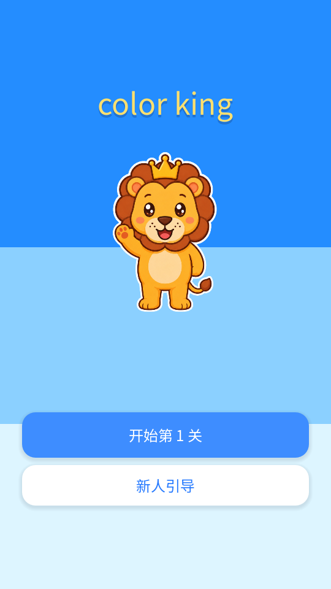
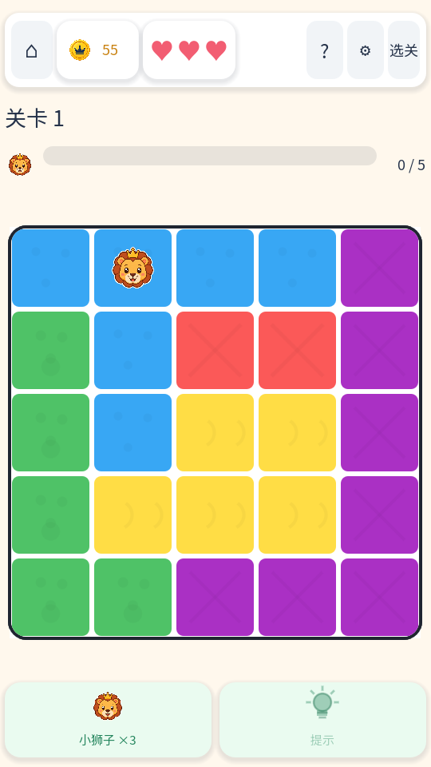
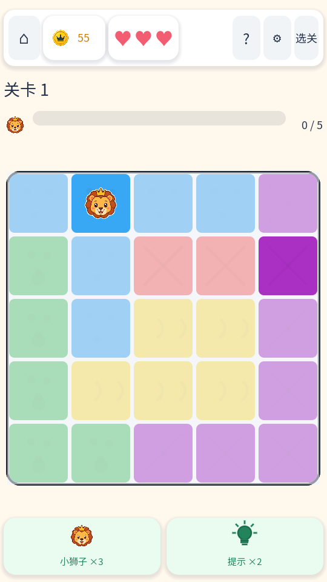
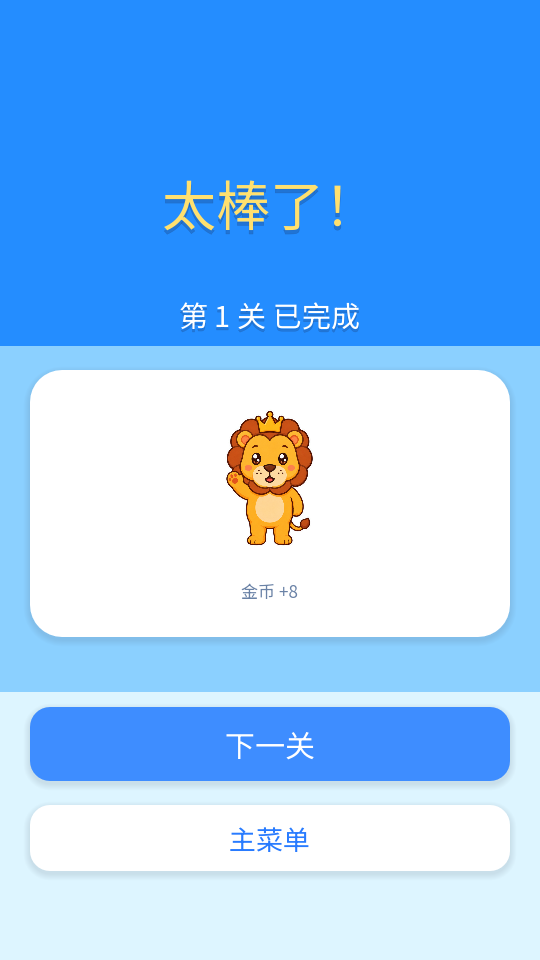
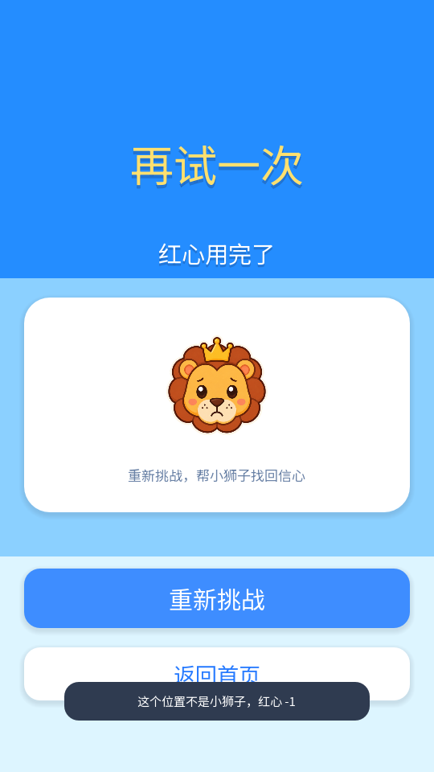

# color king 产品需求文档

最后更新：2026-07-23
适用分支：`jydoit/dev`
当前阶段：Godot MVP

## 1. 文档目的

本文档用于记录 color king 当前产品范围、功能模块、功能逻辑、实现原理和回归测试要求。后续每次功能迭代都必须同步更新本文档，并在正式发布前按本文档执行测试回归。

本文档是项目的产品事实源：

- 新增功能时，先补充或更新对应模块说明。
- 修改玩法、经济、界面、关卡或提示逻辑时，同步更新受影响模块。
- 发布前，以“回归测试清单”为准逐项验证。

## 2. 产品概述

color king 是一款竖屏移动端休闲逻辑谜题。玩家在彩色区域棋盘中找出所有小狮子，需要同时满足四条规则：

- 每一行有且仅有一个小狮子。
- 每一列有且仅有一个小狮子。
- 每个颜色区域有且仅有一个小狮子。
- 小狮子不能八方向相邻。

## 2.1 项目核心约束

以下约束优先级高于普通 UI 和数值调优；后续实现、测试和验收都必须遵守。

### 2.1.1 核心玩法逻辑

- 核心目标是让用户从棋盘格子中找出所有小狮子。
- 每一行、每一列、每个颜色区域都必须有且仅有一个小狮子。
- 小狮子之间不能挨着，任意两个小狮子不能出现在八方向相邻格。
- 用户可以对格子做两类判断：标记小狮子、标记排除。
- 正式关卡的小狮子尝试判定使用预设标准答案坐标；通关仍要求最终棋盘满足上述规则。

### 2.1.2 核心棋盘交互

- 一般情况下，格子初始状态为空。
- 单击空格表示排除该格，格子显示 X。
- 再次单击已排除格表示取消排除，格子恢复为空。
- 按住并滑过多个可标记格时，应批量处理普通排除 X：从空格开始滑动时连续标记普通 X，从普通 X 开始滑动时连续取消普通 X。
- 双击空格表示尝试标记小狮子。
- 小狮子在视觉上统一使用戴皇冠的卡通小狮子头像贴图，棋盘、开局提示动画、进度和结果页不得继续使用 Unicode 皇冠字符。
- 开局只提供 1 个提示小狮子时，多语言文案必须使用正确单数语法；英文显示 `1 lion is provided at the start`。
- 双击空格或普通排除 X 时，若该格是标准答案格则放置小狮子；若不是标准答案格，则扣除 1 个红心并把该格标记为不可修改的红色 X。
- 正式关卡按展示关卡序号分配红心：第 1-10 关 3 个，第 11-30 关 2 个，第 31 关起 1 个；红心为 0 时，本关失败并显示关卡失败页。
- 滑动操作只能处理普通排除 X，不能标记小狮子，不能改变小狮子或提示小狮子；一次滑动开始时决定是标记模式还是取消模式，过程中不来回翻转。
- 普通排除 X 可以取消。

### 2.1.3 棋盘颜色

- 棋盘颜色需要鲜明、容易区分。
- 相邻颜色区域不应使用相近颜色，避免玩家难以辨认边界。
- 棋盘不能只依赖颜色传达区域信息；棋盘底色为白色，只有棋盘最外缘使用黑色边框，不同颜色区域之间不画深色线，统一保留白色格间距、独立圆角和轻量底纹，让每个格子保持独立圆角矩形，帮助色弱或对颜色不敏感的用户区分区域轮廓；区域底纹不得采用交叉线或近似 X 的图形，以免与玩家标记混淆。
- 默认色板固定使用“明亮经典”10 色：`#38A7F4`, `#FB5958`, `#4FC267`, `#FFDD45`, `#AA30C4`, `#FF9A3D`, `#35D6D0`, `#FF7BC8`, `#A7DE38`, `#5F7CFF`。
- 当前正式关卡最多使用 9 个颜色区域，第 10 个靛蓝色作为后续 10 区域关卡预留；当前 5x5-9x9 正式关卡使用前 9 色。

## 3. 目标用户与体验方向

目标用户是偏休闲的逻辑谜题玩家。产品体验目标：

- 上手轻：通过首页、关卡、提示和即时纠错降低理解成本。
- 逻辑清楚：正式关卡提示只给出可排除目标，不直接告诉小狮子答案；新手教程和帮助浮窗负责解释规则原因。
- 节奏短：默认关卡覆盖 5x5 到 9x9，适合碎片化游玩。
- 可持续迭代：关卡、提示、经济和主界面可以逐步扩展。

## 4. 当前版本范围

已实现：

- 休闲闯关首页。
- 5x5 到 9x9 color king 棋盘玩法。
- 1670 个默认关卡，覆盖 5x5 到 9x9。
- 难度标记：新手、普通、困难、专家。
- 无猜解题路径数据：`logicStatus`、`hintSteps`、`solveSteps`。
- 教学提示：单候选、候选锁定、成组锁定、反证排除、直接冲突排除。
- 金币、提示次数、通关奖励。
- 本地存档。
- Godot 冒烟测试和新手教程冒烟测试。

已接入但后续可继续打磨：

- 失败机制已接入正式关卡：前 10 关 3 个红心、第 11-30 关 2 个、第 31 关起 1 个；非标准答案小狮子尝试扣红心并标记红色 X，红心归零显示失败页。

未完成或占位：

- 排行榜、活动、队伍、商店、宝箱为占位入口。
- 当前不显示广告位。

## 5. 信息架构

主要页面：

- 首页：主视觉、开始关卡、新人引导入口。
- 新手引导教程：首次进入第一关前，用单张 5x5 教程棋盘图串联双击找小狮子、滑动排除、同行同列排除、提示线索和通关目标。
- 关卡页：棋盘、规则提示、选关、提示。
- 通关结果页：通关反馈、小狮子奖励展位、下一关、主菜单。

核心数据：

- `data/levels.json`：关卡配置、答案、难度、提示路径和无猜解题路径。
- `user://color_queens_save.json`：本地存档。
- 新手引导完成状态应写入本地存档，用于决定后续是否直接进入正式关卡。

## 6. 模块需求

### 6.1 首页模块

用户目标：明确当前在 color king 主界面，看到主视觉和最核心入口，一键进入当前关卡；开发/验收时可快速模拟新人引导。

功能逻辑：

- 首屏显示与关卡结果页一致的蓝色主色系背景和 color king 主视觉。
- 首页不显示顶部金币、生命、星数、设置按钮。
- 首页不显示左侧每日奖励、宝箱入口。
- 首页不显示右侧活动、排行榜入口。
- 首页不显示底部星、杯、主页、队、设导航。
- 中下部只显示“开始关卡”和“新人引导”按钮。
- 首页不显示庭院、章节进度或装修进度。
- “新人引导”按钮用于验收和调试，点击后模拟新用户状态，重新进入新手引导教程。

当前实现：

- UI 由 `scripts/main.gd` 中 `_build_home_screen()` 及其子函数动态构建。
- 首页主操作由 `_build_home_primary_buttons()` 构建。
- “开始关卡”调用当前关卡流程；“新人引导”调用 `_simulate_new_user_flow()` 重置教程完成状态并进入教程。
- 资源、活动、排行榜、宝箱和底部导航入口已从首页隐藏。

运行截图与验收说明：



正向需求：

- 首页以 `color king` 标题、蓝色主背景和胜利全身小狮子作为第一视觉焦点。
- 主按钮进入当前应玩的关卡；次按钮进入新人引导。
- 首页按钮保持大尺寸、低干扰、易点击，适合移动端单手操作。

禁止项：

- 不使用旧版矢量小狮子或与胜利页不一致的角色形象。
- 不显示庭院进度、排行榜、资源堆叠、底部导航或广告入口。

回归测试重点：

- 点击开始关卡进入关卡页。
- 点击新人引导会重新进入新手引导。
- 首页不显示金币、生命、星数、左侧入口、右侧入口和底部导航。

### 6.2 关卡页模块

用户目标：完成当前关卡，清楚知道关卡进度、剩余操作和规则反馈。

功能逻辑：

- 顶部栏包含加大的返回首页按钮、金币图标与余额、独立红心体力槽、帮助、设置和“选关”按钮；底部操作区同一行只显示小狮子头像与次数、灯泡与次数两个道具按钮，不重复显示“小狮子”或“提示”文字；不显示排行榜或其它资源入口。
- 关卡标题只显示关卡编号，不显示关卡名称。
- 帮助按钮打开小型“消除规则”浮窗，使用三张棋盘示意图和配套文字说明：小狮子八个邻格标记 X、每行每列只有一个小狮子、每个颜色区域只有一个小狮子。
- “选关”按钮打开关卡选择弹窗；弹窗采用每页 20 关、每行 5 个的大触控数字宫格，提供上一页、下一页、已选关卡和“进入关卡 N”确认按钮，用户确认后直接切换到所选正式关卡。
- 正式关卡不显示“国王提示”或其它教练文字卡；新手教程仍显示必要的教学文案。
- 正式关卡点击提示后只改变棋盘视觉和可操作范围，不显示提示解释文字或成功提示 Toast。
- 棋盘占据主要空间，正式关卡底部保留小狮子直找和提示按钮。
- 底部不显示广告占位。

当前实现：

- UI 由 `scripts/main.gd` 中 `_build_game_screen()` 及其子函数构建。
- 冲突状态由 `_validate_and_update()` 更新。
- 教练文字卡仅在新手教程中显示；进入正式关卡后隐藏并退出纵向布局，释放空间主要交给棋盘。
- 关卡页左右安全留白为 `6px`，棋盘内部总缩进为 `10px`；在 540px 宽竖屏下，5x5 棋盘实际绘制范围不小于 `510 x 510px`。
- 顶部编辑和底部广告入口已从关卡页移除；顶部资源栏显示加大的首页入口、金币、本关红心、帮助、设置与选关入口，底部操作区显示小狮子直找和提示按钮。
- 帮助内容由 `scripts/main.gd` 构建，三张规则示意图由 `scripts/rule_illustration.gd` 使用现有狮子小狮子贴图与棋盘色板绘制。
- 帮助、选关、教程确认和金币不足提示统一由 `scripts/dialog_controller.gd` 管理，使用游戏内遮罩、暖白卡片、统一边框、圆角、阴影、按钮和开关动效，不依赖系统窗口外观。
- 新手教程复用正式关卡的顶部标题、小狮子进度、帮助入口、红心槽和底部两道具布局；教程期间仅将“选关”替换为“跳过”，避免绕过引导进入正式关卡。

运行截图与验收说明：


正向需求：

- 关卡页顶部承载返回首页、金币、红心、帮助、设置和选关；关卡标题、进度条、棋盘和底部两道具形成清晰纵向层级。
- 棋盘在移动端 540px 宽基准下占据主要视觉面积，底部只保留“小狮子直找”和“提示”两个按钮。
- 红心默认静止，失去后同尺寸变灰；小狮子进度与棋盘状态同步。

禁止项：

- 不显示清除、撤销、广告、排行榜或编辑入口。
- 正式关卡不显示新手教练文案卡，不把提示说明文字塞回关卡页。

回归测试重点：

- 页面在移动端宽度下按钮和棋盘不溢出。
- 正式关卡不显示黄色教练文字区；隐藏后棋盘布局高度相应增大，顶部栏仅小幅增高。
- 关卡页顶部显示加大的首页按钮、金币余额、本关红心、帮助、设置与选关入口，底部显示小狮子直找和提示按钮，不显示排行榜、编辑和广告。
- 点击帮助按钮会打开消除规则浮窗，三张示意图和文字分别准确表达邻格、行列和颜色区域规则。
- 所有模态弹窗同一时间只显示一个，并统一拦截底层棋盘输入、支持取消键关闭和移动端安全边距。
- 点击“选关”可打开选择弹窗，并能进入所选关卡。
- 关卡标题只显示关卡编号。
- 新手教程显示与正式关卡一致的标题、帮助、红心、小狮子进度和两道具布局，并以“跳过”替代“选关”。

### 6.3 棋盘交互模块

用户目标：通过点击格子标记排除，通过双击格子尝试找出小狮子，直观看到颜色区域、小狮子、普通 X、红色 X、冲突和提示可操作范围。

功能逻辑：

- 单击空格标记普通排除 X。
- 再次单击普通排除 X 取消标记，恢复为空格。
- 已找到确认的小狮子、提示小狮子和开局小狮子都保持锁定，不可单击、双击或滑动修改。
- 按住并从空格开始滑动时，沿途空格连续标记为普通排除 X。
- 按住并从普通 X 开始滑动时，沿途普通 X 连续取消为空格；滑动经过小狮子或提示小狮子时保持原状态。
- 双击空格或普通排除 X 尝试标记小狮子。
- 双击标准答案格放置张嘴开心笑、眼睛带高光的小狮子；双击非标准答案格会显示居中的不可修改红色 X，同时只扣除 1 个红心，不扣除小狮子直找次数、提示次数或金币。
- 正式关卡进入或重试时按展示关卡序号重置红心：第 1-10 关 3 个、第 11-30 关 2 个、第 31 关起 1 个；错误小狮子尝试扣 1 个红心，红心为 0 时锁定棋盘并弹出关卡失败页。
- 小狮子直找按钮与提示按钮同一行显示，采用“图标 ×次数”的紧凑横排结构，不显示道具名称；每个用户初始 3 次，点击后直接把一个未找到的标准答案格标记为锁定小狮子，免费次数用完后在图标旁显示金币价格。
- 当前版本不在关卡底部暴露清除和撤销按钮；已确认小狮子和错误红色 X 锁定，用户通过重新挑战重置棋盘。
- 内部兼容撤销逻辑也只能改变普通 X，不得移除正确小狮子、提示小狮子、开局小狮子或错误红 X；教程不再进入旧撤销/清除教学流程。
- 关卡失败页沿用通关结果页蓝色整屏风格，文案为失败反馈，按钮为“重新挑战”和“返回首页”。
- 棋盘支持鼠标点击和触屏点击。
- 有冲突时冲突格变红。
- 正式关卡使用提示时，全部提示相关格和已有 X/小狮子/错误 X 保持正常亮度，不加高亮框、不闪烁；其它空格覆盖半透明白灰浮层，并禁止点击。新手教程的相邻排除和同行同列排除阶段不使用蒙层：棋盘全部保持原亮度，本阶段全部合法目标格同时开放并显示轻量金色细边，允许一次按住连续滑动标记多个 X。
- 操作后提供轻量动画反馈；正确和错误放置必须使用同一狮子角色的不同表情，保证状态反馈清晰且角色一致。

当前实现：

- 交互状态由 `scripts/main.gd` 中 `cell_states` 管理，状态包括 `empty`、`blocked`、`piece`、`hint`、`king`、`wrong`。
- 棋盘绘制由 `scripts/game_board.gd` 自绘完成。
- 棋盘渲染使用整数像素对齐的格子尺寸和起点；每个格子保持独立圆角矩形，颜色块和提示白灰浮层使用同一套独立格子坐标，避免小数像素造成的视觉错位。
- 棋盘格子之间的缝隙统一使用白色底板填充：每个格子的圆角留白也归入间隔层，同色相邻格和不同色相邻格之间都不画深色线，只保留白色格间距，避免格子合并成大色块；棋盘最外缘使用深色外框色，外框以四条整数像素边带绘制，保证主关卡和教程中的宽度、颜色一致。
- 共享颜色、棋盘间隔、圆角、线宽和标记参数统一由 `scripts/ui_tokens.gd` 提供，页面和棋盘引用同一套运行时设计 token。
- 普通 X 使用带浅色细描边的深色线条，错误红 X 使用浅色粗描边、深红主线和柔和红色底晕，确保在全部默认区域色上均可辨认。
- 关卡标题下方显示小狮子进度条和 `已找到 / 本关总数`；有开局提示小狮子时先显示数量浮层，再将小狮子逐个动画移动到对应格子并更新进度。
- 开局提示小狮子的回弹动画只调整字号，最大不超过格子尺寸的 `72%`，边缘格动画不得越过棋盘外框。
- `GameBoard` 通过 `cell_pressed(row, col)`、`cell_double_pressed(row, col)`、`cell_drag_started(row, col)`、`cell_dragged(row, col)`、`cell_drag_ended()` 信号把点击、双击和滑动传回主逻辑。
- 高亮类型包括 `unit`、`candidate`、`exclude`、`place`。
- `play_cell_feedback()` 只用于普通 X 的轻量点击反馈；正确小狮子使用 `play_king_reveal()` 弹性出现，错误红 X 使用 `play_wrong_feedback()` 短震动；提示和小狮子直找不播放高亮框或闪烁动画。

运行截图与验收说明：



正向需求：

- 棋盘使用白色底板、独立圆角格、明亮 10 色色板和轻量底纹，让颜色区域与单个格子都能被识别。
- 棋盘最外缘使用连续深色外框；格子之间保留白色间距，同色区域内部和不同色交界都不画深色分割线。
- 普通 X、小狮子、错误红 X 必须居中显示，错误红 X 约占格子 70% 且锁定不可修改。

禁止项：

- 不把同一区域合并成大色块。
- 不在不同颜色区域之间额外画黑线或深色线。
- 已确认的小狮子和错误红 X 不允许再次点击取消。

回归测试重点：

- 第一次点击为空格标记 X。
- 第二次点击同格取消普通 X。
- 按住从空格开始滑动可连续标记普通 X；按住从普通 X 开始滑动可连续取消普通 X；滑动不会影响已确认小狮子、提示小狮子、开局小狮子或错误红色 X。
- 双击正确答案格显示小狮子并触发反馈。
- 已确认小狮子再次单击、双击或滑动经过时都保持不变。
- 双击非答案格显示红色 X、只扣除 1 个红心并触发反馈；不得扣除小狮子直找次数、提示次数或金币。红色 X 不可通过单击或滑动修改。
- 点击小狮子按钮会直接找到一个锁定小狮子并优先消耗 1 次免费次数；免费次数为 0 后显示金币价格，金币足够时仍可继续使用。
- 普通 X、红色 X、小狮子、高亮和冲突图形可见且不遮挡棋盘。
- 棋盘在不同窗口尺寸下保持正方形比例。

### 6.4 规则与冲突模块

用户目标：放错时能及时知道哪里违反规则。

功能逻辑：

- 任意两个小狮子如果同行、同列、同颜色区域或八方向相邻，则视为冲突。
- 开启即时纠错时，冲突格高亮。
- 即时纠错当前为内部开关，不提供前端设置入口。

当前实现：

- `_find_conflicts()` 遍历当前小狮子位置并检查四类冲突。
- `_validate_and_update()` 负责刷新错误状态和进度；正式关卡不展示教练提示文字。
- `immediate_errors` 控制是否显示即时错误。

运行截图与验收说明：


正向需求：

- 规则判断以行、列、颜色区域和八方向相邻四类约束为基础。
- 发生冲突时，冲突反馈必须帮助用户理解错误来源，同时不改变棋盘整体布局。

禁止项：

- 不用永久闪烁或强干扰动画表达冲突。
- 不用系统弹窗打断每一次普通冲突反馈。

回归测试重点：

- 同行、同列、同区域、相邻两个小狮子均显示冲突。
- 关闭即时纠错后不显示红色冲突，但通关仍要求无冲突。

### 6.5 提示模块

用户目标：通过棋盘上的视觉差异找到当前可以确定排除的非小狮子空格，并单击画普通 X。

功能逻辑：

- 正式关卡提示范围只能包含可排除的非小狮子空格，不提示小狮子位置，也不把候选观察格或推理单元放入可操作范围。
- 提示消耗免费次数；免费次数用完后消耗金币。
- 免费提示初始为 3 次。
- 免费次数用完后，逻辑提示价格为当前关卡奖励基数的 `1 倍`；按钮直接展示本次金币价格。
- 提示通过整盘半透明白灰蒙层、正常亮度的提示相关格和可操作范围表达，不显示文字解释；不同颜色区域之间仍不额外绘制深色线。
- 正式关卡提示范围内的全部格子统一使用 `exclude_empty`，保持正常亮度、允许单击画 X，不加高亮框、不闪烁；已有 X/小狮子仍保持正常亮度，但不进入提示操作范围。
- 当前棋盘没有可确定排除的非小狮子空格时，提示不生效，也不扣除免费次数或金币。
- 提示应优先给出可以推进棋盘的逻辑判断。

当前提示策略顺序：

1. 候选锁定：某单元候选全部落在另一单元内，返回另一单元中可以画 X 的格子。
2. 成组锁定：多个单元共同锁定一组行、列或颜色区域，返回组外可以画 X 的格子。
3. 反证排除：如果某格是小狮子会导致某个单元无解，返回该格作为 X 目标。
4. 直接冲突排除：已有小狮子导致某格必然冲突，返回该格作为 X 目标。

当前实现：

- `_use_hint()` 执行提示消耗并设置棋盘视觉与可操作范围，不更新任何玩家可见提示文案。
- `GameBoard` 先对整个棋盘（含格间接缝）绘制统一蒙层，再在蒙层上重绘提示相关格、已有 X 和小狮子，从绘制结构上避免逐格蒙层造成的接缝错位。
- `_build_best_next_hint()` 负责选择当前最佳提示。
- 相关策略函数集中在 `scripts/main.gd` 的提示逻辑区。
- 提示策略仍可在内部生成推理信息，但正式关卡不向玩家展示这段文字。
- 关卡数据中的 `solveSteps` 记录无猜路径，但当前运行时提示主要按当前棋盘动态计算。

运行截图与验收说明：



正向需求：

- 点击提示后，一次性展示全部可操作提示格；提示格保持正常亮度，可以直接单击画普通 X。
- 非提示空格覆盖半透明白灰遮罩，用户仍能看出原颜色和底纹轮廓，但明确感到该区域被暂时屏蔽。
- 已有小狮子、普通 X、错误红 X 保持正常显示，不被遮罩覆盖。

禁止项：

- 不逐个显示提示格，不给提示格加闪烁框或额外高亮框。
- 不让非提示区域继续响应点击。
- 不把候选观察格、推理单元或小狮子答案格当作可操作提示格。

回归测试重点：

- 点击提示不会自动找出小狮子。
- 正式关卡提示范围中的每一格都是空白非小狮子格，并且都能单击变成普通 X。
- 提示会消耗 1 次免费提示或按当前关卡动态核销金币。
- 金币不足时展示购买金币 / 观看激励广告选择弹窗，不自动播放广告。
- 提示后不出现解释卡或成功 Toast，只通过棋盘图像差异表达提示范围。
- 提示生效时可操作范围至少包含一个非小狮子 X 目标；候选观察格、推理单元和其它空格不进入提示范围。
- 对 50 关至少能从数据层证明唯一解和 no-guess 路径存在。

### 6.6 关卡数据模块

用户目标：获得稳定、可解、难度递进的关卡内容。

功能逻辑：

- 默认包含 1670 个关卡，覆盖 5x5 到 9x9。
- 每关包含唯一答案。
- 每关必须标记难度。
- 每关必须标记 `logicStatus: no_guess`。
- 每关必须包含 `hintSteps` 和 `solveSteps`。

当前实现：

- 数据文件：`data/levels.json`。
- 加载器：`scripts/level_store.gd`。
- 出关导演：`scripts/level_director.gd`，负责解耦玩家显示关卡顺序与 `levelId`。
- 前 10 个显示关卡固定编排：1-5 为 5x5 simple，6-8 为 5x5 medium，9 为 5x5 simple，10 为 5x5 hard 挑战关。
- 第 10 关之后根据玩家进度、size、难度和最近行为动态选择关卡；关卡选择按 size/difficulty 索引读取，并用最近 50 个 `levelId` 做去重。
- 玩家通过“选关”列表手动进入关卡时，列表项目、进入后的顶部标题、提示消息和存档中的当前显示关数必须统一使用所选数据关卡的 `levelId`，不得沿用进入前的玩家进度或数组下标。
- 动态 size 解锁节奏为：30 关起保持 5x5；80 关起开放 5x5-6x6；180 关起开放 5x5-7x7；300 关起采样 6x6-8x8；450 关起采样 6x6-9x9。
- 每逢 10 的整数关为挑战关；挑战关后一关为缓冲关，保持挑战关 size、难度降低一档，并显示提示小狮子。
- 第 11-50 关保留提示小狮子；50 关后每隔 5 关屏蔽一次提示小狮子。
- 动态提示小狮子数量按棋盘 size 加权：5x5 固定 1 个，6x6 为 1-2 个，7x7 为 1-3 个，8x8 及以上为 1-3 个。
- 基础校验包括行列尺寸、区域行列数和答案数量。
- 更完整的唯一解与路径校验目前由 `tests/smoke_test.gd` 覆盖。

功能截图与交互流转：


回归测试重点：

- `levels.size() >= 50`。
- 每关为 5x5 到 9x9 之一。
- 每关答案满足行、列、区域唯一和不相邻。
- 每关唯一解。
- 每关存在难度、`logicStatus`、`hintSteps`、`solveSteps`。

### 6.7 通关与奖励模块

用户目标：完成关卡后获得明确反馈，看到奖励展示，并能继续下一局或回到主菜单。

功能逻辑：

- 当小狮子数量等于目标数且无冲突时通关。
- 每次成功完成关卡都会按本关参数结算金币，重玩也按实际表现重新结算。
- 通关结果页使用整屏奖励结构：蓝色背景、顶部完成文案、中部胜利小狮子展位和底部按钮。
- 顶部核心文案为“太棒了！”和“第 X 关 已完成”。
- 中部排行榜位置先使用胜利小狮子展位，不显示排行榜；广告位置先不显示。
- 不显示奖励进度栏和广告位置。
- 主按钮文案为“下一关”，进入下一关；次按钮文案为“主菜单”，返回首页。

当前实现：

- `_complete_level()` 处理完成状态、奖励、保存和弹窗。
- 金币奖励由 `scripts/coin_economy.gd` 统一计算：5x5 到 9x9 的尺寸基础值依次为 `10 / 14 / 18 / 23 / 28`。
- 有开局提示小狮子时，本关奖励基数为尺寸基础值的 `80%`。
- 每次错误小狮子尝试使奖励在本关基数上降低 `25%`，最终奖励最低不低于本关基数的 `50%`。
- `_next_level()` 和 `_replay_level()` 处理弹窗按钮。
- `completion_overlay` 为全屏通关结果页；成功结算的角色展位显示一只开心站立的橘色小狮子狮子。每次进入结算页时随机选择自然挥手、逐步吐舌头或眨眼做鬼脸动画。角色身体保持固定位置、固定比例且不旋转，仅通过逐帧贴图表现动作；逐帧动画使用不等长帧时长与动作停顿，避免机械循环感。
- 结算页只展示真实产生的金币奖励，不展示没有后续用途的“获得小狮子 +1”虚拟奖励。
- 关卡完成会记录耗时、步数、提示数和难度收益；收益计算的耗时上限为 15 分钟。
- 成功打开下一关会为上一局补记继续游玩收益；次日 24 小时内再次打开会为所有符合条件的完成局补记次留收益。

运行截图与验收说明：





正向需求：

- 成功页使用蓝色整屏结构，顶部显示“太棒了！”和“第 X 关 已完成”，中部展示胜利全身小狮子和金币奖励，底部提供“下一关”和“主菜单”。
- 失败页沿用同一蓝色体系，顶部显示失败反馈，中部展示低落/流泪小狮子，底部提供“重新挑战”和“返回首页”。
- 结果页以角色和下一步行动为核心，按钮必须清楚、可点击、层级明确。

禁止项：

- 不显示排行榜、广告占位、奖励进度条或没有真实用途的虚拟奖励。
- 失败页不提供金币复活入口；截图脚本可能捕获到瞬时 Toast，但 Toast 不属于失败页基准结构。

回归测试重点：

- 正确解完成后显示通关结果页。
- 通关金币与棋盘尺寸、开局提示小狮子数和错误次数一致。
- 错误次数再多，通关奖励也不会低于本关奖励基数的一半。
- 已完成关卡重复通关按本次表现重新结算，不能重复写入已完成关卡 ID。
- 下一关按钮尺寸足够明显且可点击。
- 主菜单按钮返回首页。

#### 6.7.1 金币核销与动态定价

设计目标：用透明、可预测的软货币循环支持提示和小狮子直找，在不加入插屏广告的前提下，为愿意主动获取帮助的玩家提供可选激励广告入口。

功能逻辑：

- 金币发放、道具价格和流水统计统一由 `scripts/coin_economy.gd` 管理，页面层不独立硬编码价格。
- 免费逻辑提示和免费小狮子直找次数耗尽后仍可继续使用，对应价格分别为本关奖励基数的 `1 倍`、`3 倍`。
- 红心耗尽时失败页不提供复活入口；主按钮为“重新挑战”，副按钮为“返回首页”。
- 若最近 3 次通关均未使用金币兑换道具，则下一次道具价格减去 `max(1, 本关奖励基数 × 20%)`，降低首次付费使用门槛。
- 同一局中每发生一次金币兑换，折扣逐步减弱；累计 3 次兑换后回到标准价格。
- 金币不足时只弹出“购买金币 / 观看激励广告 / 稍后再说”选择，不自动播放广告、不打断正常解题。
- 单次激励广告补币至少为本关一个奖励基数，同时保证足够补齐当前道具缺口，且不超过本次道具价格；目标是一次广告可解决当前需求，但不制造大量额外囤币。
- 当前版本购买和激励广告按钮为 SDK 接入占位，不直接伪造到账；后续接入时必须在回调成功后才发放金币。
- 游戏不使用强制插屏广告；激励广告只由玩家在金币不足且主动使用道具时选择。

统计字段：

- `recentCompletions`：最近通关的关卡、尺寸、提示小狮子数、错误次数、奖励和本局金币兑换次数。
- `toolExchangeCounts`：按逻辑提示、小狮子直找分别累计兑换次数。
- `totalCoinEarned`、`totalCoinSpent`：累计发放和核销金币，用于后续平衡经济系统。

回归测试重点：

- 道具按钮显示的价格与实际扣款一致。
- 金币不足不产生负数，不修改道具次数或棋盘状态，并展示自愿获取金币入口。
- 失败页点击“重新挑战”会重置当前关卡和红心；点击“返回首页”回到首页。
- 不使用道具的玩家不会被自动弹出广告或插屏广告打断。

### 6.8 存档模块

用户目标：退出后能恢复当前进度。

功能逻辑：

- 保存当前关卡、棋盘状态、金币、提示次数、小狮子直找次数、已完成关卡、完成状态、即时纠错开关和经济统计。
- 保存新手引导状态，包括是否已完成、是否已开始、当前教程步骤。
- 启动时自动读取存档，用于恢复正式关卡进度或判断是否直接进入新手引导。
- 存档版本支持兼容迁移。

当前实现：

- 存档路径：`user://color_queens_save.json`。
- `_load_save()` 加载并兼容旧版本。
- `_save_game()` 在关键状态变化后写入。
- 当前保存字段包括 `currentLevelIndex`、`currentLevelId`、`playerLevelNumber`、`activeSchedule`、`directorProgress`、`economyProgress`、`runStartedUnix`、`runMoveCount`、`runHintCount`、`runCoinExchangeCount`、`cellStates`、`isCompleted`、`isFailed`、`coinCount`、`heartCount`、`hintCount`、`completedLevels`、`immediateErrors`、`tutorialCompleted`、`tutorialStarted`、`tutorialStepIndex`。
- `directorProgress` 保存最近通关记录、size/difficulty 统计、下一关开启和次留补记状态。
- 首页点击“开始关卡”时，如果当前恢复的正式关卡已经完成，会自动推进并加载下一关，避免停留在已完成且不可操作的棋盘。
- `SAVE_VERSION` 当前为 7，新增保存 `selectedLanguage`。

功能截图与交互流转：


回归测试重点：

- 关卡切换、点击格子、使用提示、通关、新手教程推进后会保存。
- 重新启动后恢复最近关卡、棋盘状态和教程状态。
- 已完成关卡从首页继续时应进入下一关，且下一关可正常点击、滑动和双击操作。
- 新存档首次启动会因为没有 `tutorialCompleted` 而直接进入新手引导。
- 旧版本存档不会导致启动失败。

### 6.9 新手引导教程模块

用户目标：在正式进入第一关前，用最短路径理解 color king 的基础操作和核心规则，避免玩家第一次进入正式关卡时不知道如何点击、如何判断、如何求助。

触发与入口：

- 新用户首次安装或清除存档后，启动产品默认直接进入新手引导教程，不需要先点击首页按钮。
- 新手引导完成后显示“开始挑战”按钮，玩家点击后进入第 1 关正式关卡。
- 已完成新手引导的用户再次点击“开始关卡”时，直接进入当前正式关卡，不重复强制引导。
- 首页“新人引导”按钮可模拟新用户状态，重置教程完成状态并从新手引导开始。
- 首页“新人引导”按钮可重新进入新手引导教程。
- 教程中显示“跳过”按钮；正式关卡页不显示教程按钮。

教程整体规则：

- 新手引导使用单张 5x5 可操作教程棋盘图，在同一棋盘里让玩家理解全部核心规则，不污染正式第 1 关的棋盘进度。
- 教程棋盘必须包含颜色区域、小狮子、普通 X、滑动手势/方向提示和核心规则摘要。
- 教程必须包含双击找小狮子、滑动批量排除 X、小狮子相邻排除、同行同列排除、提示线索、小狮子直找和完整找出全部小狮子。
- 教程页面复用正式关卡的首页、金币、红心、帮助、标题、小狮子进度与底部小狮子直找、提示布局；选关入口在教程期间替换为“跳过”。
- 教程文案统一使用“找到小狮子”或“找出小狮子”，不得使用动作类摆放说法。
- 教程允许跳过；用户选择跳过后视为完成新手引导，并直接进入第 1 关正式关卡。
- 教程完成状态必须保存；用户中途退出并重新进入时，可以继续教程或重新开始。
- 教程不消耗正式关卡的免费提示次数、金币、红心或通关奖励。

单张教程棋盘流程：

1. 初始聚焦第一个小狮子目标格，文案显示“每个颜色区域都要找到一个小狮子。现在这个区域只剩一个可选格，双击找到它。”。
2. 玩家双击找到小狮子后，进入相邻排除阶段，文案显示“小狮子不能和小狮子挨着。滑过它周围的格子，把这些位置标记为 X。”。
3. 相邻格排除完成后，进入同行同列排除阶段，文案显示“每行、每列都只能有一个小狮子。这个小狮子所在的行和列，其他格都可以标记 X。”。
4. 排除完成后，引导点击提示按钮，文案显示“点一下提示，看看下一步该观察哪里。”。
5. 点击提示后给出下一个小狮子线索，文案显示“每个颜色区域都要找到一个小狮子。现在这个区域只剩一个可选格，双击找到它。”。
6. 第二个小狮子的排除完成后，引导点击“小狮子直找”，直接生成并锁定第三个小狮子；教学使用不扣除正式免费次数，也不扣金币。
7. 小狮子直找完成后继续处理该小狮子尚未完成的规则排除；当前教学棋盘的周围位置已经排除，因此直接进入同行同列排除。
8. 后续小狮子直接给线索，引导玩家继续在同一张棋盘里找出全部 5 个小狮子。
9. 最后一个小狮子使用行列线索，文案显示“每行、每列都要找到一个小狮子。现在只剩这个位置符合规则，双击找到最后一个小狮子。”。
10. 全部小狮子找出后显示“已经了解全部规则，开始真正的挑战吧！”和“开始挑战”按钮。

完成与进入正式关卡：

- 用户完成教程后点击“开始挑战”，或点击“跳过”并确认后，写入教程完成状态并进入第 1 关正式关卡。
- 用户中途退出教程后，下次点击“开始关卡”时可继续教程或重新开始。
- 进入正式第 1 关时，棋盘应为空白正式状态，不继承教程中的任何小狮子、X、高亮或蒙层状态。
- 新手引导完成状态写入存档；如果用户清除存档或首次安装，则重新触发。

当前实现：

- 已实现。新存档启动后直接进入单张 5x5 新手教程棋盘；完成教程或跳过后进入第 1 关正式关卡。
- 教程由 `TUTORIAL_LEVELS` 的 `single_map` 配置和教程状态机驱动；双击找小狮子等单目标步骤可使用单格聚焦，相邻排除和同行同列排除阶段取消棋盘蒙层、一次开放当前规则组全部合法格，并配合小手滑动动画、提示与小狮子直找按钮引导和最终开始挑战入口。
- 教程与正式关卡共用顶部、进度和底部道具组件；提示和小狮子直找只在对应教学阶段启用。
- 正式关卡页隐藏教程按钮。

回归测试重点：

- 新存档首次启动必须直接进入单张 5x5 新手教程棋盘，而不是停留在首页或直接进入第 1 关。
- 教程必须完整展示双击找小狮子、滑动排除、同行同列排除、提示线索、小狮子直找和核心规则。
- 教程保持正式关卡两道具布局；提示和小狮子直找按教程阶段依次启用。
- 教程小狮子直找必须生成锁定提示小狮子，且不消耗正式关卡免费次数或金币。
- 文案必须使用“找到小狮子”或“找出小狮子”。
- 找完教程棋盘全部小狮子并点击“开始挑战”后必须进入第 1 关正式关卡。
- 通关目标说明必须解释每行、每列、每个颜色区域各一个小狮子，且小狮子不能相邻；同时说明进度反馈的含义。
- 点击“跳过”并确认后必须直接进入第 1 关正式关卡，并保存教程完成状态。
- 教程完成后进入第 1 关正式关卡，棋盘状态为空白且无教程高亮或蒙层。
- 教程完成状态保存后，重新启动再点击“开始关卡”不重复强制教程。
- 正式关卡页不显示教程按钮；首页“新人引导”按钮可用于重新体验新手引导。

### 6.10 多语言与设置模块

用户目标：首次启动时自动使用设备语言，并可以随时从关卡页顶部设置入口切换游戏语言。

功能逻辑：

- 新存档默认读取设备系统 locale；中文、阿拉伯语、法语和拉丁语分别映射为 `zh`、`ar`、`fr`、`la`，其它系统语言回退为英语 `en`。
- 当前支持 English、中文、العربية、Français、Latina 五种语言。
- 关卡页顶部齿轮按钮打开统一风格的语言设置弹窗；用户选择语言并点击“应用”后立即刷新界面。
- 用户主动选择的语言保存到存档，后续启动优先使用已保存语言，不再覆盖为系统语言。
- 所有运行时界面文案由 `scripts/localization_controller.gd` 注册和格式化，页面脚本不维护另一套语言判断。
- 阿拉伯语启用 RTL 页面方向，并使用随包发布的 Noto Sans Arabic fallback；中文继续使用 Noto Sans SC，英语、法语和拉丁语使用同一字体的拉丁字符。
- 动态关卡编号、道具次数、价格和结果数值先翻译模板，再插入运行时数值。

当前实现：

- `LocalizationController` 负责系统语言识别、五语言翻译资源注册、动态文案格式化和 RTL 判断。
- `main.gd` 负责设置入口、语言选择弹窗、布局方向切换以及 `selectedLanguage` 的存取。

回归测试重点：

- 五种语言均可从设置弹窗选择，重新打开设置时保持当前选项。
- 阿拉伯语使用 RTL 布局并能显示阿拉伯字符；其它语言恢复 LTR。
- 未保存语言时按照系统 locale 选择，未知 locale 回退英语。
- 错误提示、教程、帮助、道具次数、关卡编号和结果页面不出现未翻译的中文回退。

### 6.11 音效反馈模块

体验目标：声音应服务于安静、温暖的逻辑解谜氛围，避免短促、尖锐、频繁抢占注意力的电子提示音。

音效方向：

- 默认采用“木质玩具 + 轻金属 + 纸面”的声音语言：普通 X 使用短促干净的小金属敲击声，取消 X 使用橡皮往返摩擦纸张声；正确小狮子、错误、红心损失、提示和通关使用柔和木质敲击音。
- 普通高频操作保持轻且短，正确、错误与红心损失使用不同音高走向区分，不依赖明显增大音量表达状态。
- 通关音效允许更完整的上行旋律，但不得刺耳或产生削波；普通 UI 点击音只用于重要按钮，避免每个页面动作都播放声音。
- 第一轮素材位于 `assets/audio/candidates/`，映射说明位于 `assets/audio/README.md`，可由 `tools/generate_audio_sfx.py` 确定性重新生成。
- `scripts/audio_controller.gd` 统一管理音量、随机变体、滑动标记节流和并发播放；页面脚本只调用语义化播放方法，不直接散落加载与播放逻辑。
- 当前接入事件包括普通 X、取消 X、滑动批量标记与取消、正确小狮子、错误小狮子、红心损失、提示、小狮子直找和通关。

候选素材技术规格：`44.1 kHz / 16-bit / mono WAV`，所有文件必须保留峰值余量且不得削波。

## 7. 关键参数

| 参数 | 当前值 | 位置 | 说明 |
| --- | --- | --- | --- |
| 初始金币 | 55 | `scripts/main.gd` | 新存档默认金币 |
| 初始免费提示 | 3 | `INITIAL_HINT_COUNT` | 新存档默认提示次数 |
| 初始小狮子直找 | 3 | `INITIAL_CROWN_FIND_COUNT` | 新存档默认直找小狮子次数 |
| 尺寸奖励基数 | 10 / 14 / 18 / 23 / 28 | `CoinEconomy.SIZE_BASE_REWARDS` | 对应 5x5 到 9x9 |
| 开局小狮子奖励系数 | 80% | `OPENING_KING_REWARD_MULTIPLIER` | 有提示小狮子时降低奖励 |
| 错误奖励扣减 | 每次 25%，最低 50% | `MISTAKE_PENALTY_PER_COUNT` | 只影响本局通关结算 |
| 逻辑提示价格 | 1 × 本关奖励基数 | `TOOL_HINT` | 免费提示耗尽后核销 |
| 小狮子直找价格 | 3 × 本关奖励基数 | `TOOL_CROWN_FIND` | 免费直找耗尽后核销 |
| 首次兑换折扣 | 20% 基数，3 次兑换内回归 | `INACTIVE_TOOL_DISCOUNT_RATE` | 最近 3 次通关未兑换时生效 |
| 每关红心 | 1-10 关为 3；11-30 关为 2；31 关起为 1 | `_heart_limit_for_display_level()` | 正式关卡每次进入/重试时按展示关卡序号重置 |
| 关卡红心动效 | 默认静止，状态变化时短促反馈 | `_update_heart_label()` | 不持续跳动；失去的红心同尺寸变灰并恢复正常大小 |
| 默认棋盘尺寸 | 5x5-9x9 | `data/levels.json` | 由关卡导演按进度解锁 |
| 默认关卡数 | 1670 | `data/levels.json` | MVP 内置关卡 |
| 动态提示小狮子 | 11-50 关默认显示，50 关后每 5 关屏蔽 | `LevelDirector._should_reveal_dynamic_kings()` | 提示小狮子开局带动画 |
| 新手引导触发 | 新存档启动后立即进入 | `scripts/main.gd` | 完成后写入存档，后续不再强制触发 |
| 新手引导形式 | 单张 5x5 教程棋盘 | `TUTORIAL_LEVELS` | 用同一张棋盘图串联核心操作和规则 |
| 新手引导棋盘 | 5x5 | `TUTORIAL_LEVELS` | 教程全程不换图，让用户在同一棋盘上逐步找出全部小狮子 |
| 新手引导跳过 | 允许 | 顶部“跳过”按钮 | 二次确认后视为完成并进入第 1 关 |
| 新手引导跳过入口 | 教程中显示 | 顶部“跳过”按钮 | 正式关卡页隐藏 |
| 新人引导按钮 | 首页常驻 | `_simulate_new_user_flow()` | 用于模拟新用户状态并重新进入教程 |
| 教程完成反馈 | 找完教学地图全部小狮子后显示开始挑战 | `_show_tutorial_challenge_ready()` | 用户点击开始挑战进入第 1 关 |
| 全局 UI 字体 | Noto Sans SC + Noto Sans Arabic | `assets/fonts/`、`project.godot` | 字体随项目打包，中文和阿拉伯语不依赖系统字体回退 |

## 8. 功能模块测试用例

### 8.1 用例管理规则

- 用例编号是需求、自动测试、视觉截图和发布报告之间的稳定追溯键，格式为 `<模块>-<三位序号>`。
- 自动化等级分为 `A`（自动断言）、`V`（运行截图视觉回归）、`D`（Android 真机或云真机）、`M`（人工操作）。
- 发布级别分为 `P0`（失败即阻断发布）、`P1`（必须修复或由产品负责人书面接受）、`P2`（记录后可延期）。
- 每次修改需求时必须同步修改对应测试用例；每次新增测试时必须在输出中打印用例编号。
- `A` 通过只能证明代码行为；`V` 通过只能证明 Godot 540×960 运行时视觉；`D` 通过才证明本次 APK 在指定 Android 设备上的实际表现。

### 8.2 首页与导航

| 编号 | 前置条件与操作 | 预期结果 | 验证 | 级别 |
| --- | --- | --- | --- | --- |
| HOME-001 | 启动已有存档并进入首页 | 显示 `color king`、胜利小狮子、开始关卡和新人引导 | A+V+D | P0 |
| HOME-002 | 点击开始关卡 | 进入当前应玩关卡；已完成关卡自动前进 | A+M | P0 |
| HOME-003 | 点击新人引导 | 重置教程完成状态并进入单张 5x5 教程 | A+M | P0 |
| HOME-004 | 检查首页全部入口 | 不显示金币、红心、排行榜、活动、宝箱和底部导航 | A+V+D | P0 |

### 8.3 关卡页与棋盘交互

| 编号 | 前置条件与操作 | 预期结果 | 验证 | 级别 |
| --- | --- | --- | --- | --- |
| LEVEL-001 | 进入正式关卡 | 顶部显示首页、金币、红心、帮助、设置、选关；底部仅显示小狮子和提示 | A+V+D | P0 |
| LEVEL-002 | 在 540×960 及目标设备打开 5x5、9x9 关卡 | 页面不裁切；棋盘保持正方形且主要按钮可点击 | A+V+D | P0 |
| LEVEL-003 | 打开帮助、设置和选关弹窗 | 使用统一模态层；遮挡底层输入；关闭和返回键有效 | A+M+D | P0 |
| LEVEL-004 | 打开选关、翻页并点击数字关卡 | 每页最多 20 个大触控数字按钮；选中态清楚；确认按钮、顶部标题和存档均使用所选 `levelId` | A+V+M+D | P0 |
| BOARD-001 | 单击空格，再次单击同格 | 第一次添加普通 X，第二次取消 | A+M+D | P0 |
| BOARD-002 | 双击标准答案格 | 放置并锁定小狮子，播放弹性出现反馈 | A+M+D | P0 |
| BOARD-003 | 单击、双击或滑过已确认小狮子 | 小狮子保持不变 | A+M+D | P0 |
| BOARD-004 | 从空格开始连续滑动 | 沿途合法空格批量添加普通 X | A+M+D | P0 |
| BOARD-005 | 从普通 X 开始连续滑动 | 沿途普通 X 批量取消，不改变锁定状态 | A+M+D | P0 |
| BOARD-006 | 双击非答案格 | 只扣 1 颗红心并生成锁定红 X，不扣道具或金币 | A+M+D | P0 |
| BOARD-007 | 在第 10、11、30、31 展示关进入/重试 | 红心上限依次按 3、2、2、1 设置 | A | P0 |
| BOARD-008 | 红心降至 0 | 棋盘锁定并进入失败页 | A+V+D | P0 |
| BOARD-009 | 制造同行、同列、同区域和相邻冲突 | 开启即时纠错时准确标出冲突，通关判定仍拒绝冲突 | A | P0 |

### 8.4 提示、道具与经济

| 编号 | 前置条件与操作 | 预期结果 | 验证 | 级别 |
| --- | --- | --- | --- | --- |
| HINT-001 | 正式关卡使用提示 | 目标只包含可画普通 X 的非答案空格 | A+M | P0 |
| HINT-002 | 提示状态下点击目标和非目标 | 目标可画 X；非目标不可操作 | A+M+D | P0 |
| HINT-003 | 查看提示态 | 非目标覆盖白灰蒙层；目标与已有标记保持正常亮度；无文字、框、光环或闪烁 | A+V+D | P0 |
| HINT-004 | 当前没有合法排除目标时使用提示 | 不消耗免费次数或金币 | A | P0 |
| TOOL-001 | 使用前三次小狮子直找 | 每次直接放置一个锁定答案小狮子并扣 1 次免费次数 | A+M | P0 |
| TOOL-002 | 免费次数耗尽后使用道具 | 点击前显示价格；余额足够时正确扣款并刷新 | A+M | P0 |
| TOOL-003 | 金币不足时使用道具 | 弹窗显示价格、余额和缺口，不产生虚假到账 | A+V | P1 |
| ECON-001 | 完成不同尺寸、提示数量和错误次数的关卡 | 奖励和价格符合 `CoinEconomy` 规则，最低奖励不低于基础奖励的 50% | A | P0 |

### 8.5 教程、结果、存档与本地化

| 编号 | 前置条件与操作 | 预期结果 | 验证 | 级别 |
| --- | --- | --- | --- | --- |
| TUTOR-001 | 删除存档后启动 | 自动进入单张 5x5 新手教程 | A+V+D | P0 |
| TUTOR-002 | 完成教程全部阶段 | 依次覆盖双击、无蒙层多格连续滑动排除、行列排除、提示、直找和全部小狮子；正式提示蒙层规则不受影响 | A+V+M+D | P0 |
| TUTOR-003 | 教程使用小狮子直找 | 放置锁定小狮子但不消耗正式次数或金币 | A | P0 |
| TUTOR-004 | 完成或确认跳过教程 | 保存完成状态并进入正式第 1 关 | A+M | P0 |
| RESULT-001 | 完成正式关卡 | 显示蓝色成功页、胜利小狮子、下一关和主菜单 | A+V+D | P0 |
| RESULT-002 | 红心耗尽 | 显示蓝色失败页、失败小狮子、重新挑战和返回首页，无金币复活 | A+V+D | P0 |
| SAVE-001 | 标记棋盘、修改资源后重启 | 当前关卡、棋盘、金币、次数和完成记录正确恢复 | A+M+D | P0 |
| SAVE-002 | 使用上一存档版本启动 | 兼容迁移或安全回退，不丢失可保留进度 | A+M | P0 |
| I18N-001 | 切换中、英、法、拉丁语 | 文案翻译且布局恢复 LTR，无缺字和裁切 | A+V+D | P1 |
| I18N-002 | 切换阿拉伯语 | 页面与弹窗使用 RTL，棋盘坐标和逻辑不镜像 | A+V+D | P0 |
| AUDIO-001 | 执行 X、取消、正确、错误、掉心、提示、直找和通关 | 每个事件只播放对应的短促反馈，设置开关有效 | A+M+D | P1 |
| MOTION-001 | 放置正确小狮子、错误红 X、停顿约 8 秒 | 分别播放弹性出现、短震动和轻微摇头，不持续干扰 | A+M+D | P1 |

### 8.6 关卡数据与编辑器

| 编号 | 前置条件与操作 | 预期结果 | 验证 | 级别 |
| --- | --- | --- | --- | --- |
| DATA-001 | 加载全部默认关卡 | 数据结构完整，尺寸为 5x5-9x9，难度值合法 | A | P0 |
| DATA-002 | 校验全部默认关卡 | 每关唯一解，标准答案满足全部规则 | A | P0 |
| DATA-003 | 校验推理数据 | 每关含 `logicStatus: no_guess`、`hintSteps` 和 `solveSteps` | A | P0 |
| EDITOR-001 | 打开编辑器、涂色并切换答案模式 | 场景正常加载，区域和答案编辑有效 | A+M | P1 |

## 9. 发布验证与执行命令

### 9.1 统一发布验证

从项目根目录执行：

```bash
tools/run_release_validation.sh
```

默认依次运行核心、教程和编辑器自动测试，并把日志和汇总写入
`artifacts/release_validation/<时间戳>/`。测试输出必须能映射回本节用例编号。
发布入口还会运行 `tests/save_compat_test.gd`，分别验证当前存档完整重启恢复和
上一版本存档迁移；日志中出现 GDScript `SCRIPT ERROR`、断言失败或 JSON 解析失败时，
即使 Godot 进程返回 0，也必须判定该测试组失败。

需要生成 Godot 540×960 视觉回归截图时执行：

```bash
tools/run_release_validation.sh --visual
```

视觉截图完成后必须按 `docs/UI_DESIGN_GUIDE.md` 第 13 节复核。自动截图或差异工具不能自行批准视觉发布。

### 9.2 发布门禁

正式打包或发布必须同时满足：

1. 全部 P0 自动测试通过，P1 失败已修复或有明确接受记录。
2. 受影响页面的 540×960 截图已生成并完成视觉复核。
3. 本次 APK 已记录生成时间、路径和 SHA-256。
4. APK 已在 Android 真机或认可的云真机上安装，D 类用例已执行并留存截图。
5. UI 报告列出通过项、不一致项、未能验证项、设备和包版本。
6. 文档、代码、测试和基准截图保持一致。

仅模拟器通过时状态只能写“Android 模拟器通过，待真机”；没有 D 类证据时不得标记正式可发布。

## 10. 迭代更新规则

每次迭代按以下顺序执行：

1. 确认当前分支基于 `jydoit/dev`，或处在用户明确指定的开发分支。
2. 阅读本文档，确认要改的模块和影响范围。
3. 修改功能实现。
4. 同步更新本文档：新功能加入对应模块，行为变化更新功能逻辑，参数变化更新关键参数，新风险加入回归测试清单。
5. 运行自动测试。
6. 按影响范围做手动回归。
7. 提交代码。

## 11. 后续建议

优先补齐：

- 给提示系统增加可视化分层，例如“观察范围”“可排除原因”“建议操作”。
- 增加手机真机或 Godot 移动预览回归步骤。
- 将活动、排行榜、宝箱、任务等占位入口拆成明确版本规划。
